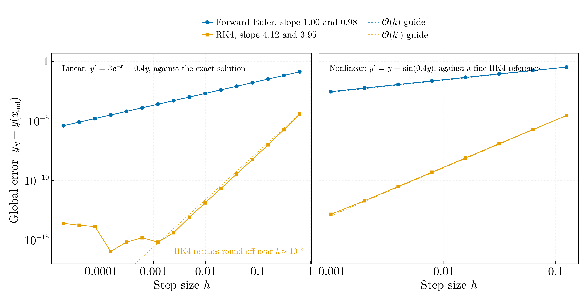
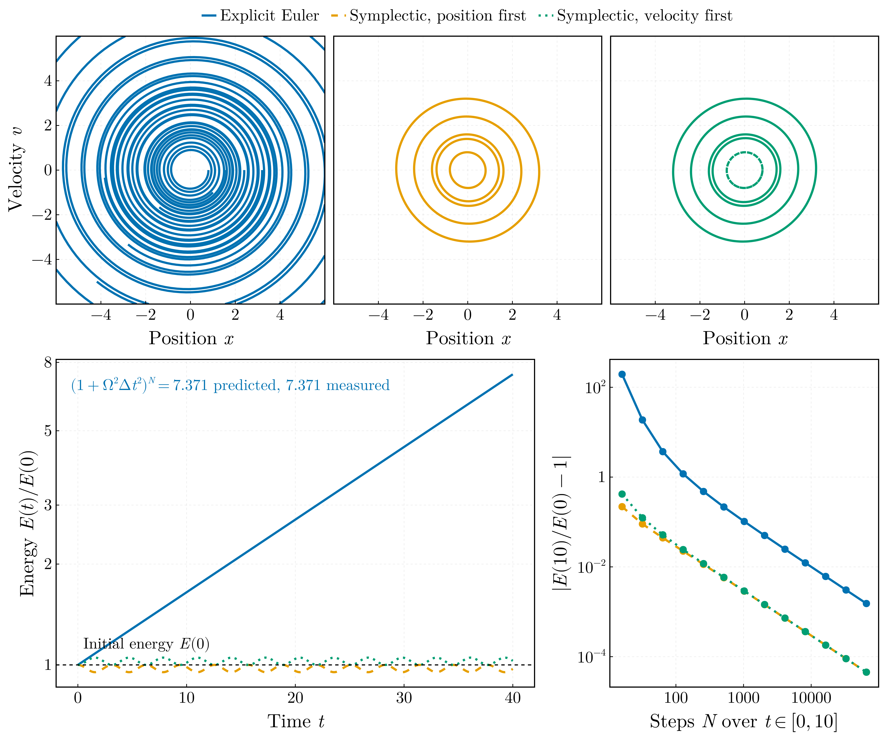
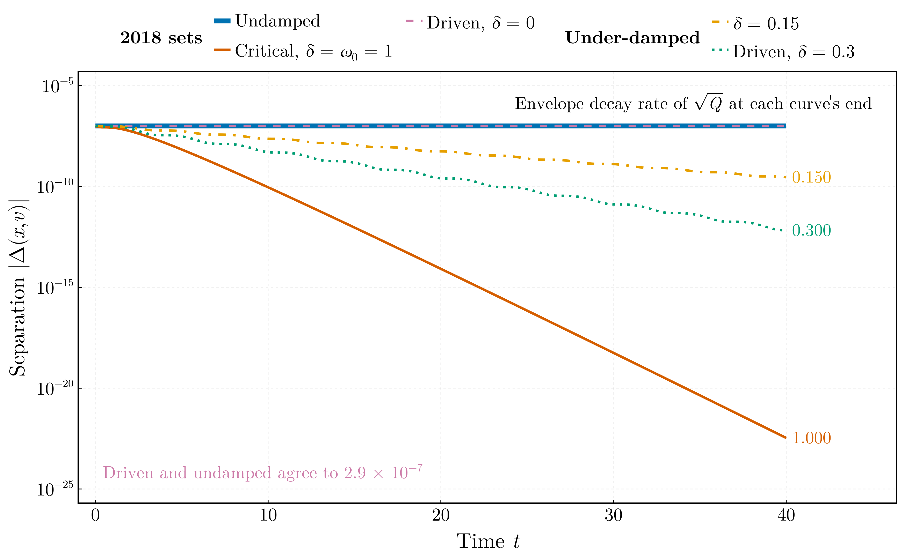

# Oscillators and integrators — BSc year 1 (2017–2018)

First-year work, originally written in C++ and ported to Julia: three scripts on
the harmonic oscillator and on the accuracy of the elementary schemes used to
integrate it. Each asserts its own result against a closed form.

## `integrator_order_comparison.jl`

Observed order of convergence of forward Euler and classical RK4 on two scalar
problems: `y' = 3e^{-x} - 0.4y` on [0, 5], whose exact solution is
`y = (y₀+5)e^{-0.4x} - 5e^{-x}`, and the autonomous `y' = y + sin(0.4y)` on
[0, 1], which has no closed form and is measured against RK4 in 256-bit
arithmetic (accepted only if it agrees with itself at half the step count to
1e-17).

The step count is swept over powers of two and the order read from successive
pairs, `p(h) = ln[e(2h)/e(h)] / ln 2`. Each pair carries two error terms: the
pre-asymptotic drift `|p(h) − p(2h)|`, which for `p = p₀ + c·h` equals the
distance still to go to the limit, and the round-off term `ε / (e ln 2)`, where
ε is the round-off floor measured from the sweep itself (the largest error after
the power law breaks down: 2.5e-14 and 8.3e-14). A pair is used only while its
round-off term is below its drift. The order quoted is that of the finest such
pair, and its uncertainty is the sum of the two terms; both are bounds on a
bias, not variances, and the floor is measured at more steps than the pair it is
applied to, so the uncertainty is conservative. The script asserts that each
order agrees with the nominal one within twice that uncertainty.

| Problem | Forward Euler | RK4 | RK4 pair used (geometric-mean h) | drift | round-off |
|---|---|---|---|---|---|
| `y' = 3e^{-x} - 0.4y` | 1.000 ± 0.001 | 4.028 ± 0.029 | 2.8e-2 | 0.028 | 0.002 |
| `y' = y + sin(0.4y)` | 1.000 ± 0.001 | 3.994 ± 0.010 | 5.5e-3 | 0.006 | 0.004 |

The RK4 pairwise orders run 4.39, 4.21, 4.11, 4.06, 4.03 on the linear problem
and 3.91, 3.95, 3.98, 3.99, 3.99 on the nonlinear one before round-off enters.
Finer pairs exist above the floor, but there the round-off term (0.03 to 0.06)
exceeds the drift, so they say less about the order, not more. A straight-line
fit through the whole sweep mixes the pre-asymptotic points with the floor; it
is not used. Euler's errors never come within eight decades of the floor, and
its uncertainty is the 0.001 resolution the orders are printed to.

Ported from `Runge_Kutta_trial.cpp` and `Euler_ODE.cpp` on the `legacy` branch
(`Code_Archive/Old_2018/C_C++/`). Both schemes are coded there correctly. The
programs read the step count and interval from standard input, so the values
used in 2018 are not recorded, and they printed the endpoint value only: there
was no reference solution and no sweep, hence no measured order.

## `symplectic_vs_explicit_euler.jl`

Explicit Euler against the two symplectic (Euler–Cromer) variants on
`ẍ = -Ω²x`, from five initial conditions at Δt = 0.05 over 800 steps. The three
schemes agree to first order in Δt and differ completely over long times.
Explicit Euler multiplies the amplitude by √(1 + Ω²Δt²) at every step, so its
energy grows as (1 + Ω²Δt²)^N: 7.371 predicted over the 800 steps, 7.371
measured, asserted to 10⁻¹². Each symplectic variant conserves a modified
energy exactly — `E + ½ΔtΩ²xv` when the position is updated first,
`E − ½ΔtΩ²xv` when the velocity is — so its orbit closes and its energy
oscillates about E(0) by at most ½ΩΔt; both invariants hold to 2 × 10⁻¹⁵ along
the orbit from (1, −1) and are asserted. The right-hand panel repeats the
step-count sweep of the 2018 exam problem: the energy error of every scheme at
t = 10 falls as 1/N, the symplectic ones from a starting point ten times lower.

Ported from `Phase_space_ODE.cpp` and `ODE_exam_problem.cpp` on the
`legacy` branch (`Code_Archive/Old_2018/C_C++/`). The first names its explicit
scheme `EulerImplicit` — it advances both components from the old values — and
the misnomer runs through six output filenames, so everything labelled
"implicit" there is about the explicit method. It also works in single
precision on a study whose subject is accumulated integration error, and draws
its initial conditions as integers on a 101 × 101 lattice with modulo bias from
a clock-seeded `rand()`.

## `oscillator_trajectory_separation.jl`

Two trajectories of `ẍ + 2δẋ + ω₀²x = F cos ωt`, started 10⁻⁷ apart in phase
space and integrated with RK4 at Δt = 0.002 to t = 40. The three parameter sets
of the 2018 programs are run as written, next to two under-damped ones. The
system is linear, so the difference of two solutions obeys the homogeneous
equation whatever the driving does, and with ω₁² = ω₀² − δ² the quadratic form
`Q = (Δv + δΔx)² + ω₁²Δx²` decays as e^{−2δt} exactly — for under-damped,
critically damped and undamped motion alike. The Euclidean separation |Δ(x, v)|
that the 2018 programs wrote out oscillates inside that envelope, so the decay
rate is asserted on √Q, to 10⁻⁵ of the input δ, and only reported for |Δ|.

| Case | Input δ | Rate of √Q | Rate of \|Δ\|, straight-line fit |
|---|---|---|---|
| Undamped (2018) | 0 | 0.00000 | 0.00000 |
| Critical, δ = ω₀ = 1 (2018) | 1 | 1.00000 | 0.8341 ± 0.0007 |
| Driven, δ = 0, F = 10, ω = 3 (2018) | 0 | 0.00000 | 0.00000 |
| Under-damped, δ = 0.15 | 0.15 | 0.15000 | 0.14992 ± 0.00003 |
| Driven, δ = 0.3, F = 1, ω = 1.6 | 0.3 | 0.30001 | 0.30025 ± 0.00007 |

The fit to |Δ| is biased by where in the oscillation the window ends, by more
than its formal error; at critical damping the difference carries a
`(A + Bt)e^{−t}` factor and a pure exponential fit splits the difference. The
two δ = 0 separations agree to 3 × 10⁻⁷, asserted: the driving is identical
along both trajectories and cancels, so `Forced_oscillator.cpp` could not have
shown anything its undamped sibling did not. Return-time statistics of the kind
the 2018 programs were built around carry information only once the dynamics
are chaotic, which is `02-chaos-and-attractors`.

Ported from `Harmonic_oscillator.cpp`, `Damped_oscillator.cpp` and
`Forced_oscillator.cpp` on the `legacy` branch. All three read their own output
back through an `ifstream` opened on the same file as the `ofstream` still
writing it. Whatever the write buffer had not flushed by the time of the read
came back as zero — a failed extraction zeroes its target since C++11 — so the
tail of every separation series was zero, and for a run whose whole output fits
one stream buffer, all of it. The step count was read from standard input and
is not recorded, so how much of what they printed was real cannot be settled;
the analysis is done in memory here. The parameter choices were also
degenerate: the damped case uses δ = ω₀ = 1, exactly critical damping, which
does not oscillate, and the driven case uses δ = 0, so it never reaches a
steady state.
