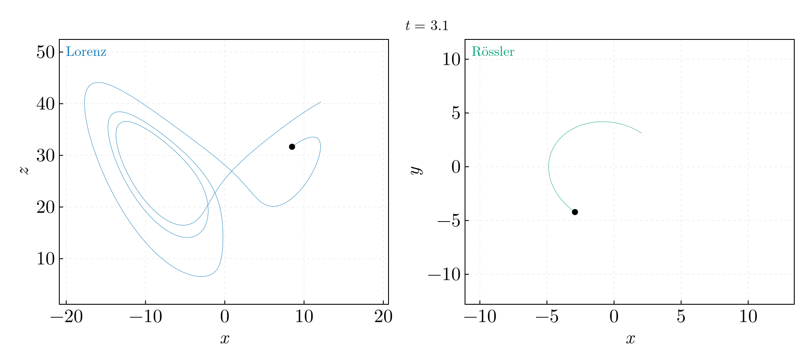

# Chaos and attractors — BSc year 1 (2017–2018)

The Lorenz and Rössler systems integrated with RK4, their largest Lyapunov
exponent from the divergence of neighbouring trajectories, and the
extremum-interval statistic of the separation that the 2018 program computed.
Ported from `Integratori.cpp`, `Atractori.cpp` and `helpers.cpp` in
`Code_Archive/Old_2018/C_C++/AtractorI/` on the `legacy` branch, with the Octave
post-processing of `Code_Archive/Old_2018/Octave/`. `attractors_core.jl` holds
the vector fields, parameters and the RK4 step both scripts share.

## `lorenz_rossler_attractors.jl`

Projections of the two attractors after a transient, 2.5 × 10⁵ points each at
h = 0.002. The non-trivial Lorenz fixed points (±√(β(ρ−1)), ±√(β(ρ−1)), ρ−1)
sit at ±8.4853 for β = 8/3; the 2018 code wrote β = 2.66, which puts them at
±8.4747. The animation traces the trajectory itself: on the Lorenz attractor the
state circles one lobe an unpredictable number of times before crossing to the
other; on the Rössler attractor it spirals outward in a near-plane and is folded
back.

The RK4 stage coupling of the original is correct. Besides β, its Rössler branch
is unreachable (the selector is assigned and never read), its output paths are
absolute Windows paths, and its parameters are `#define` macros, so `a`, `b`
and `c` textually replace any identifier of those names in the translation unit.

## `lyapunov_and_return_times.jl`

**Lyapunov exponents** by the Benettin algorithm: the perturbation is rescaled
to d₀ = 10⁻⁷ every τ = 0.1 time units and λ₁ is the mean of ln(d/d₀)/τ. The
increments are correlated, so the standard error is the largest blocked estimate
(Flyvbjerg and Petersen, J. Chem. Phys. **91**, 461 (1989),
doi:10.1063/1.457480). The script asserts agreement within three standard
errors with the values of Sprott, *Chaos and Time-Series Analysis*, Oxford
University Press (2003).

| System | Run length | λ₁ | Reference |
|---|---|---|---|
| Lorenz | 2 × 10⁴ | 0.906 ± 0.014 | 0.9056 |
| Rössler | 10⁵ | 0.0719 ± 0.0016 | 0.0714 |

A run of 400 time units, which the Lorenz value 0.9018 quoted before came
from, carries a blocked standard error of 0.10; the fourth digit was noise.

**The un-renormalised separation**, which is what the 2018 program followed,
grows from 10⁻⁷ until it saturates at the diameter of the attractor: after
16 time units for Lorenz, after 219 for Rössler, whose exponent is thirteen
times smaller. The left panel runs each system to just past its saturation.

**Extremum intervals.** `helpers.cpp` drops 30 time units at each end of the
separation series, accepts an interior extremum when it differs from the last
accepted one by more than 10⁻⁴ in relative terms, and records the min → max
and max → min intervals in two columns; the Octave scripts histogrammed them.
On the run that program made — 200 000 steps of 0.001 over 200 time units from
(1, 1, 1), Lorenz only, its Rössler branch being unreachable — the definition
gives 269 rising intervals with mean 0.237 ± 0.007 and 270 falling ones with
mean 0.282 ± 0.008. This statistic describes the oscillation of the separation
on the saturated attractor, not the exponential growth; return-time statistics
of a linear oscillator, by contrast, carry no information at all
(`01-oscillators-and-integrators`).

The program reads its own output back through an `ifstream` opened on the file
its `ofstream` is still writing, which the C++ standard does not guarantee.
Compiled with local paths and run with the inputs above, it does produce
140 001 distances, none of them zero, and 301 interval rows with mean 0.28, so
whatever its 2018 runs printed, the design does not condemn them to zeros.
`Test.m` reads `DistantaLorentz.txt`, `TimpiUCLorentz.txt` and
`DateExtreme.txt`, which no program in the archive writes, with histogram edges
`0:0.05:0.8` that match the intervals above; `AtractorDistributie.m` seeds a
six-parameter fit from `rand` and does not check its convergence flag. Neither
is ported.
