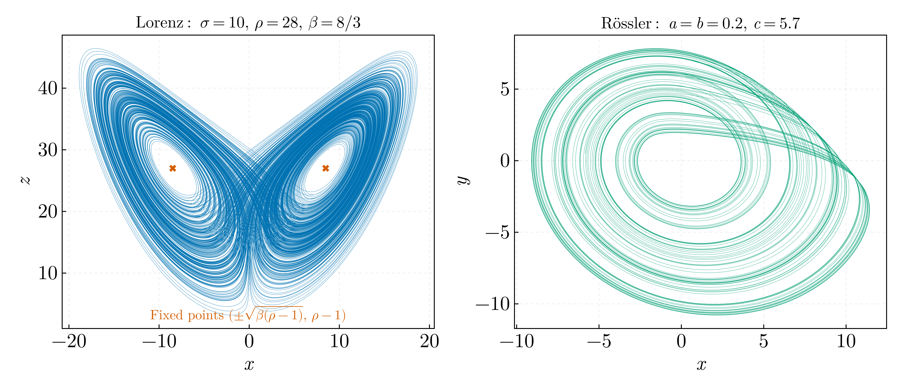
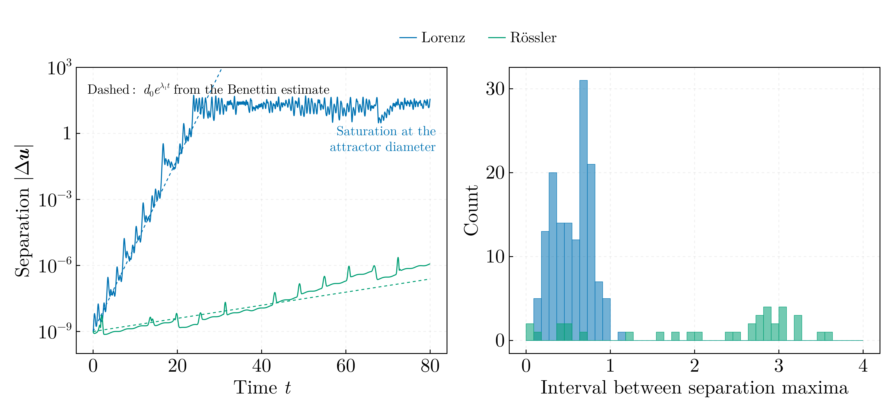

# Chaos and attractors — BSc year 1 (2017–2018)

The Lorenz and Rössler systems, integrated with RK4, and the measurement of
their largest Lyapunov exponent from the divergence of neighbouring
trajectories. Originally C++ with an Octave post-processing chain; ported to
Julia.

## `attractors_core.jl`

Vector fields, parameters and the RK4 step shared by both scripts.

## `lorenz_rossler_attractors.jl`

Projections of the two strange attractors after discarding a transient. The
non-trivial Lorenz fixed points `(±√(β(ρ-1)), ±√(β(ρ-1)), ρ-1)` sit at
±8.4853 for β = 8/3; the 2018 code wrote β = 2.66, which puts them at ±8.4747.

Ported from `Integratori.cpp` and `Atractori.cpp`. The RK4 stage coupling in the
original was correct — unusually for this archive. What was not: β truncated to
2.66; the Rössler branch unreachable because its selector variable was assigned
and never read; hardcoded Windows output paths; and the parameters written as
`#define` macros, so `a`, `b` and `c` textually replaced any identifier of those
names in the translation unit.

## `lyapunov_and_return_times.jl`

Two trajectories starting 10⁻⁷ apart in each coordinate, as `Integratori.cpp`
did, followed until their separation saturates
at the diameter of the attractor, and the distribution of intervals between
successive maxima of that separation.

The Benettin algorithm — rescaling the perturbation back to d₀ at fixed
intervals and averaging the accumulated logarithms — gives

| System | Measured λ₁ | Literature | Ratio |
|---|---|---|---|
| Lorenz | 0.9018 | 0.9056 | 0.996 |
| Rössler | 0.0686 | 0.0714 | 0.961 |

**This is the measurement the 2018 project existed to make, and never made.**
`helpers.cpp` opened an `ifstream` on the same paths as unflushed `ofstream`s,
so every extraction failed and — since C++11 — set its target to zero.
`Distanta.txt` and `TimpiUC.txt` contained only zeros, and the three Octave
scripts that histogrammed them (`AtractorDistributie.m`, `AtractorFull.m`,
`HistogrameAmbalate.m`) were fitting and binning nothing. `AtractorDistributie.m`
compounded this by seeding a six-parameter non-convex fit from `rand` and never
checking the returned convergence flag.

Contrast with `01-oscillators-and-integrators`, where the same measurement on a
linear oscillator gives a separation that decays with envelope `e^{-δt}` and has
no interior maxima at all. Return-time statistics only carry information once
the dynamics are chaotic.

`Test.m` is not ported: it read `DistantaLorentz.txt`, `TimpiUCLorentz.txt` and
`DateExtreme.txt`, none of which any program in the archive produces.
