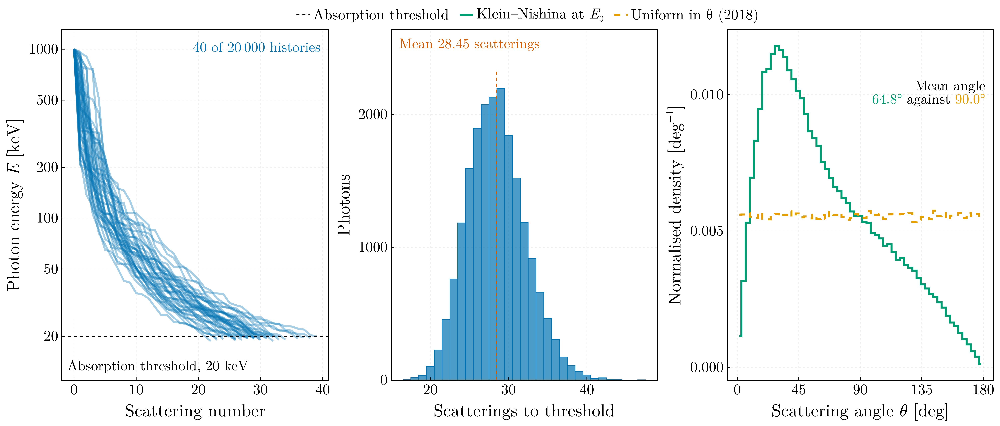
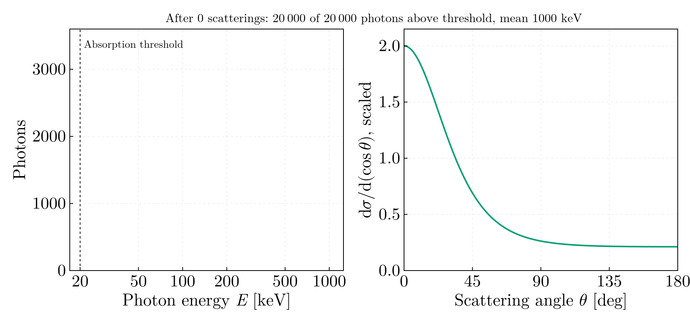

# Compton scattering — BSc year 1, semester 2 (2018)

## `compton_scattering_chain.jl`

A 1 MeV photon followed through successive Compton scatterings down to a 20 keV
absorption threshold, over 20 000 histories with a seeded stable random
stream: a mean of 28.45 scatterings, median 28, range 17–47. The scattering
angle is drawn at every step from the Klein–Nishina differential cross-section
at the photon's current energy, by rejection under the bound 2 (in units of
πrₑ²), which the forward direction attains at every energy.

The script checks the cross-section and the sampler before it uses them: the
integral of dσ/d(cos θ) against the closed-form Klein–Nishina total
cross-section at 1000, 100 and 20 keV to 10⁻⁸, the Thomson limit 1 + cos²θ,
the bound, and the mean cos θ of 2 × 10⁵ draws at 1 MeV (0.3596) against the
integral of the density (0.3602), within four standard errors. The mean
scattering angle at 1 MeV is 64.8° under Klein–Nishina against 90.0° for the
sampling of the original, drawn uniformly in θ.

The animation shows the ensemble degrading: the photon-energy distribution
after each scattering, beside the Klein–Nishina distribution at the mean energy
of the survivors. At 1 MeV it is strongly forward-peaked; by 30 keV it has
relaxed towards the symmetric Thomson form. The distribution the sampler draws
from changes at every step, which is what a single fixed distribution — let
alone a uniform one in θ — cannot represent.

Ported from `EfectulCompton.cpp` in `Code_Archive/Old_2018/C_C++/` on the
`legacy` branch. Its Compton relation, recoil-angle formula and
momentum-triangle sine rule are individually correct; its scattering angle is
drawn uniformly on [0°, 180°], which is neither Klein–Nishina nor isotropic
(isotropy is uniform in cos θ), so every energy distribution it produced was
unphysical. It also computed the scattered energy a second time from the recoil
angle by the sine rule and averaged the two, though the second value is an
algebraic identity of the first, and printed as a "standard deviation" the
relative deviation of a single sample from a running mean, cast to `int` and
taken mod 100. Neither is carried over.
