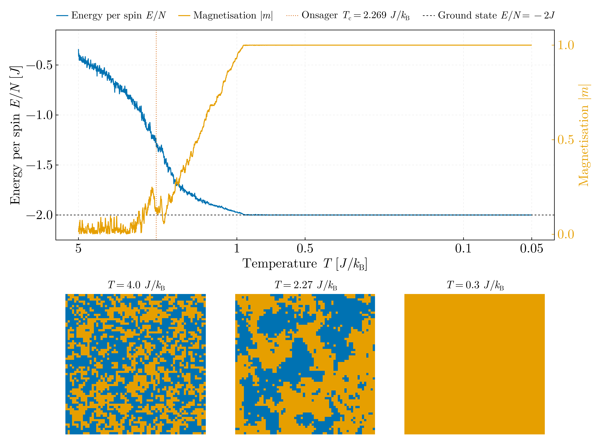
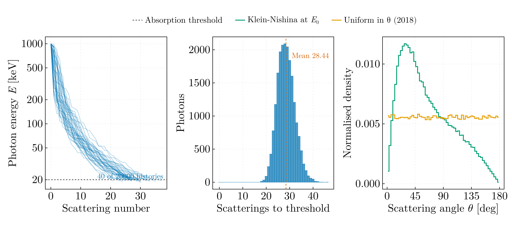

# Ising model and Compton scattering — BSc year 1 (2017–2018)

Two Monte Carlo programs from the second year, ported from C++ to Julia.

## `ising_annealing.jl`

Two-dimensional square-lattice Ising model, `H = -J Σ⟨ij⟩ sᵢsⱼ`, driven to its
ground state by Metropolis single-spin-flip dynamics under a geometrically
cooled temperature. Reaches the exact ground state `E/N = -2J` at `|m| = 1`, and
the snapshots show the disordered, critical and ordered regimes against the
exact Onsager temperature `T_c = 2/ln(1+√2) = 2.269 J/k_B`.

Ported from `IsingFinal.cpp`, which had five defects, every one of them
affecting the result:

- rows allocated `n+2` wide but columns only `n`, while the code indexed
  `a[i][n+1]` — a heap overflow of two `short`s past every row
- ghost cells bordered once *before* the Monte Carlo loop and never refreshed,
  so the periodic images were wrong after the first boundary flip
- `H` summed every bond twice and `deltaH` returned `4·J·s·Σ` where the correct
  value is `2·J·s·Σ`, so `exp(-ΔE/T)` ran at an effective temperature of **T/2**
- `T = T/step` applied per attempted flip rather than per sweep, so the
  temperature underflowed to zero within a few thousand attempts and the
  dynamics degenerated to greedy descent
- `unsigned int` loop counter tested against an `unsigned long long` bound, an
  infinite loop for any bound ≥ 2³² — and the prompt asked the user for "un
  numar foarte mare"

Periodic boundaries are handled here by modular indexing, which removes the
ghost cells entirely. The input and output files were also named `Icing`.

## `compton_scattering_chain.jl`

A 1 MeV photon followed through successive Compton scatterings down to a 20 keV
absorption threshold, over 20 000 histories. Takes a mean of 28.4 scatterings.

Ported from `EfectulCompton.cpp`. The Compton relation, the recoil-angle formula
and the momentum-triangle sine rule were all individually correct. The sampling
was not: **the scattering angle was drawn uniformly on [0°, 180°]**, which is
neither Klein–Nishina nor even isotropic scattering — isotropy is uniform in
cos θ, not in θ. The right-hand panel shows the difference; the mean scattering
angle is 64.7° under Klein–Nishina against 89.9° for the 2018 sampling, and
every energy distribution the original produced was unphysical.

Two further defects are simply gone rather than fixed. The original computed the
scattered energy a second time from the recoil angle and averaged the two, but
that second value is an algebraic identity of the first and carries no
independent information — so the recoil angle is no longer computed at all. And
its "abaterea standard" was a relative deviation of a single sample from a
running mean, cast to `int` and taken mod 100, with no sum of squares anywhere.
