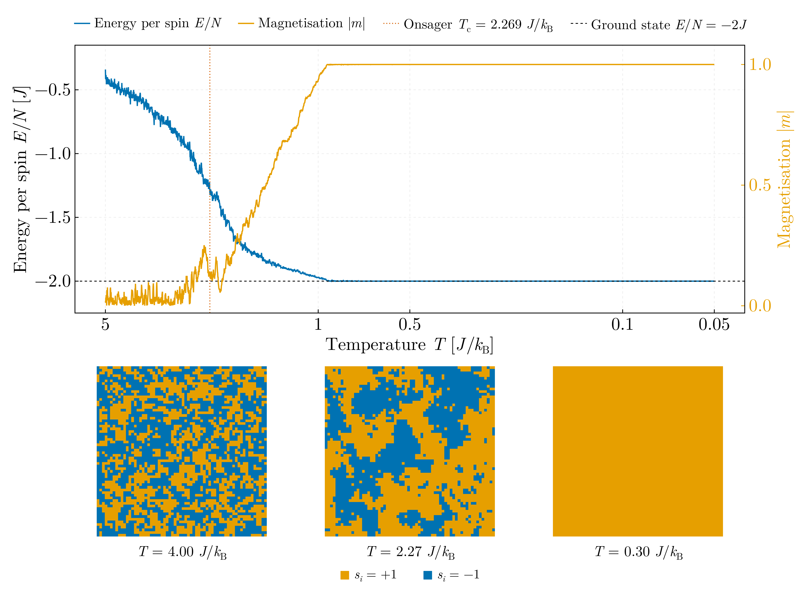
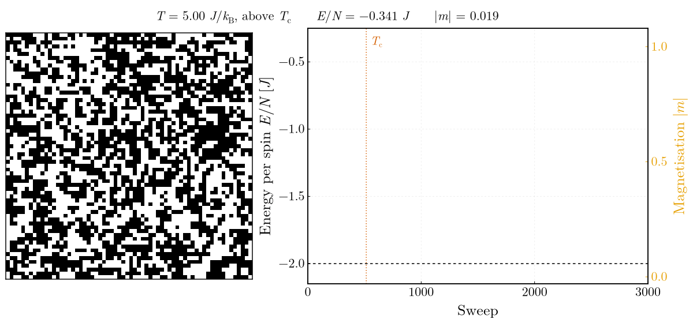

# Ising model — summer internship, 2018

## `ising_annealing.jl`

Two-dimensional square-lattice Ising model, `H = -J Σ⟨ij⟩ sᵢsⱼ`, 64 × 64 with
periodic boundaries, driven to its ground state by Metropolis single-spin-flip
dynamics under a temperature cooled geometrically from 5 to 0.05 J/k_B over
3000 sweeps, from a seeded stable random stream. The run reaches the exact
ground state `E/N = -2J` at `|m| = 1` at T = 0.93 J/k_B and holds it to the end,
which the script asserts; the snapshots show the disordered, critical and
ordered regimes against the exact Onsager temperature
`T_c = 2/ln(1+√2) = 2.269 J/k_B`. Before the anneal the script checks the
Metropolis kernel itself: the flip energy `ΔE = 2 J sᵢⱼ Σ_nb` is asserted equal
to the difference of two full energy evaluations at 400 random sites, under
periodic and under open boundaries. Spins are drawn black (+1) and white (−1);
the energy and magnetisation traces keep their own colours.

The anneal itself, a 64 × 64 lattice sampled every 20 sweeps, with the energy
and magnetisation traced out beside it. This is the figure the static one cannot
be: the snapshots show three states, the animation shows the domains forming —
small and short-lived well above `T_c`, growing and merging as the temperature
passes through it, then freezing into a single spanning domain. The
magnetisation lifts off the axis exactly where the cooling schedule crosses the
Onsager temperature, which is marked.

## What changed from the original

Ported from `Ising_model.cpp` in `Code_Archive/Old_2018/C_C++/` on the `legacy`
branch, which has five defects, every one of them affecting the result:

- rows allocated `n+2` wide but columns only `n`, while the code indexed
  `a[i][n+1]` — a heap overflow of two `short`s past every row
- ghost cells bordered once *before* the Monte Carlo loop and never refreshed,
  so the periodic images were wrong after the first boundary flip
- `H` summed every bond twice and `deltaH` returned `4·J·s·Σ` where the correct
  value is `2·J·s·Σ`, so `exp(-ΔE/T)` ran at an effective temperature of **T/2**
- `T = T/step` applied per attempted flip rather than per sweep, so the
  temperature underflowed to zero within a few thousand attempts and the
  dynamics degenerated to greedy descent
- `unsigned int` loop counter tested against an `unsigned long long` bound, an
  infinite loop for any bound ≥ 2³² — and the prompt asked the user for "un
  numar foarte mare"

Periodic boundaries are handled here by modular indexing, which removes the
ghost cells entirely. The input and output files were also named `Icing`.
