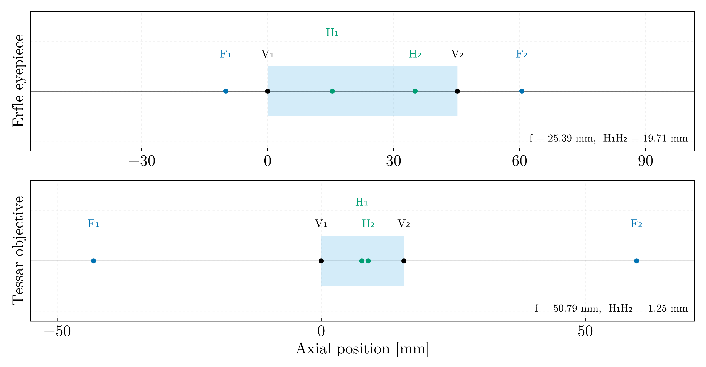
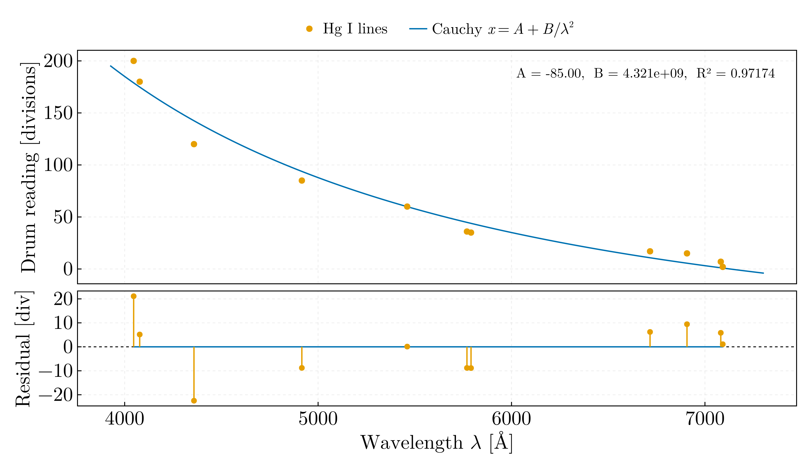

# Geometrical optics

Paraxial lens design and a spectroscope calibration, ported from Octave and
Julia.

## `paraxial_systems.jl`

Ray-transfer analysis of two classical designs. The ray state is `[n·u ; y]`
and the system matrix is accumulated from the last surface backwards.

| | Erfle eyepiece | Tessar objective |
|---|---|---|
| Surfaces | 9 | 7 |
| Σd | 45.20 mm | 15.65 mm |
| Focal length | **25.39 mm** | **50.79 mm** |
| Front focal, from V₁ | 9.97 mm | 43.11 mm |
| Back focal, from V_N | 15.33 mm | 44.06 mm |
| H₁H₂ separation | 19.71 mm | 1.25 mm |

Two independent checks that the engine and the prescriptions are right: a thin
lens of known power comes back at f = 100.000000 mm against the lensmaker value
with both principal planes at the vertex; and the Tessar lands at **50.79 mm**,
a classic normal lens for the format, which is what a design of this scale
should give.

`"Erlfe"` is a misspelling of **Erfle**, the 1921 wide-field eyepiece; the
nine-surface prescription resolves to the six-element Type II form. `Tessar.m`
is the genuine 1902 Rudolph four-element design.

Corrections to the originals:

- `f = -1/S(1,2)` was labelled "Convergenta sistemului". That is the focal
  length; the convergence, or optical power, is `P = 1/f = -S(1,2)`.
- The principal-plane separation was written `sum(d) - abs(zH1) - abs(zH2)`,
  which is correct only when both principal planes fall on the same side. The
  files' own diagrams place H₁ at `-zH1` and H₂ at `sum(d)+zH2`, so the
  separation is `sum(d) + zH1 + zH2`. **For these two prescriptions the defect
  is latent**: both zH₁ and zH₂ come out negative, so the two formulae agree to
  the digit. It would bite on any design with a principal plane on the other
  side.
- `Tessar.m` acknowledged in a comment that plotting fails for `z1 = zf1` — an
  object at the front focal plane sends the image to infinity — but never
  guarded it. `conjugate` returns `Inf` explicitly here.

Both remain strictly paraxial, as in 2018: no real ray trace, no aberrations,
and a single refractive index per glass. That last point is the real limitation,
because the cemented doublet in the Tessar and the cemented doublet and triplet
in the Erfle exist precisely to achromatise, and without dispersion data that
cannot be evaluated at all. Neither is an aperture stop modelled, so the Tessar
has no f-number.

## `hg_spectroscope_calibration.jl`

Prism spectroscope calibrated against eleven Hg I lines under the Cauchy
relation `x = A + B/λ²`.

**A transcription error in the reference data.** The original listed 5789.66 Å
beside 5790.65 Å at adjacent drum divisions 35 and 36. No Hg I line exists at
5789.66; the second member of the yellow doublet is **5769.60 Å**, and a 1 Å
splitting across one division is impossible at the ~13 Å/division local
dispersion. Corrected here — though in fairness it barely moves the fit
(R² 0.97174 against 0.97205), since it is one point of eleven and the two drum
readings differ by one division. It is worth fixing because it is a wrong
physical constant, not because it changed the answer.

What does matter is that the fit is mediocre: R² = 0.972 with an RMS residual of
11.2 divisions on a 2–200 division range, and the residual panel shows clear
systematic structure rather than scatter. The assumption that the drum reading
is linear in refractive index holds only near minimum deviation, and a
two-parameter Cauchy relation is evidently not enough across 4000–7100 Å. The
original reported none of this: it computed A and B, never printed them, never
displayed the figure and had its `savefig` commented out, so running it as a
script produced nothing whatsoever.

It also used Levenberg–Marquardt with a finite-difference Jacobian from
`p0 = [1, 1]`, nine orders of magnitude away from B ≈ 4×10⁹, for a model that is
linear in its parameters and solves in one least-squares step.
