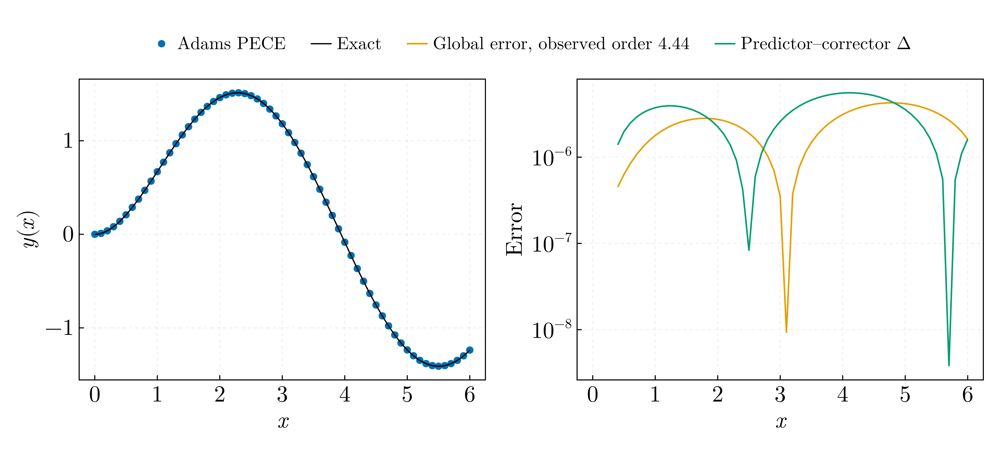
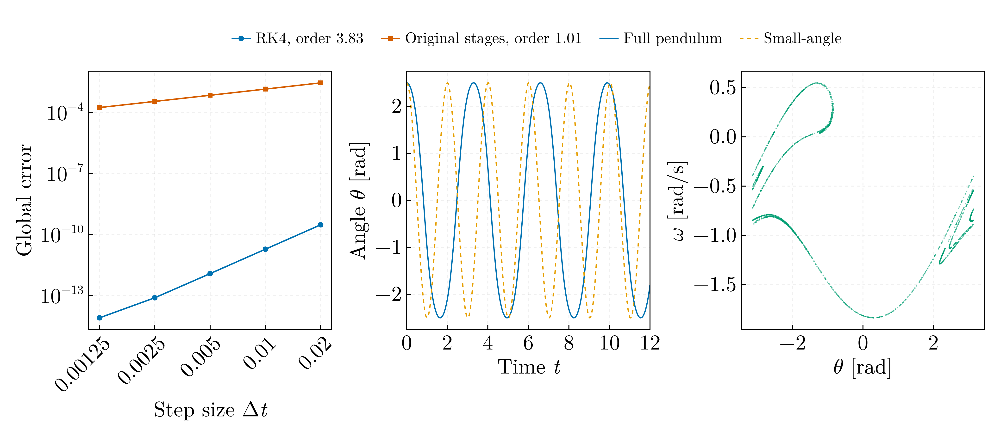
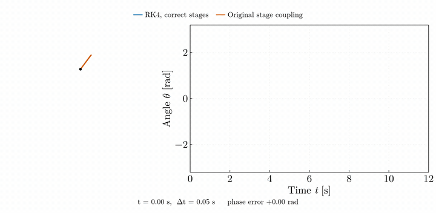
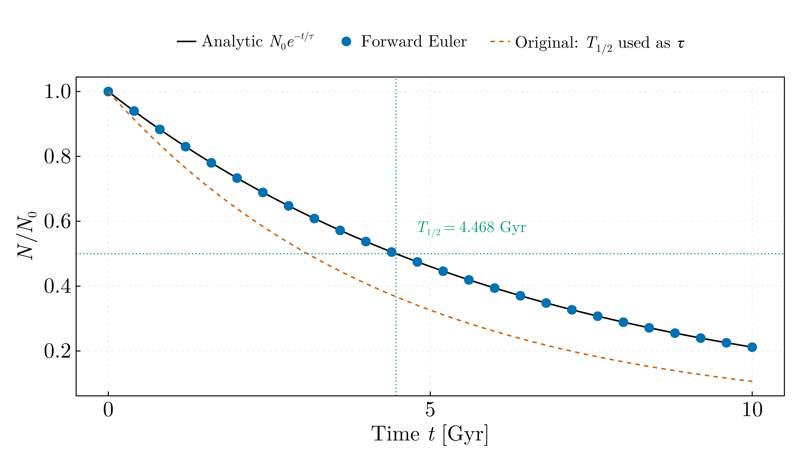
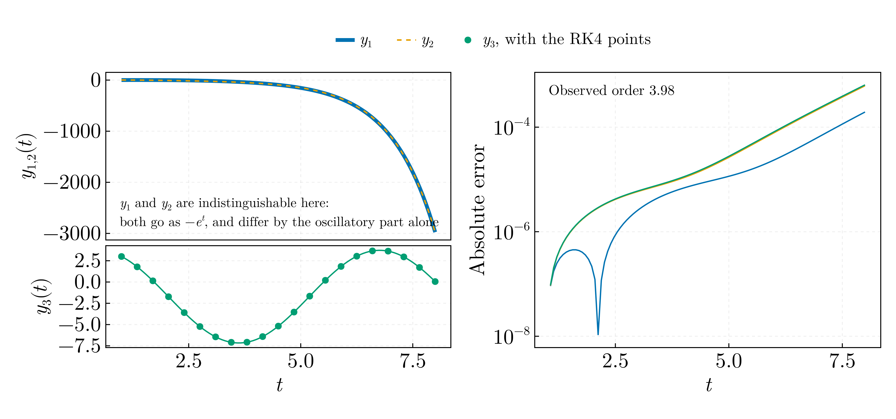

# Numerical methods — BSc, year not recorded

Octave coursework on multistep methods, Runge–Kutta and the pendulum, ported to
Julia. Every script asserts its result against a closed form or a measured order
of convergence; none of the originals compared its output with anything.
`numerics_core.jl` holds what the scripts share: one classical RK4 step and the
reduction of a step-size sweep to an observed order, with the pairwise orders
that show whether the asymptotic regime has been reached.

## `adams_predictor_corrector.jl`



Four-step Adams–Bashforth predictor with three-step Adams–Moulton corrector, in
PECE form, on `y' = -y + 2 sin x`, `y(0) = 0`, whose exact solution is
`y = sin x - cos x + e^{-x}`; interval [0, 6], step 0.1, starting values from
RK4, all as in the original. Its coefficients, h/24·(55, −59, 37, −9) and
h/24·(9, 19, −5, 1), are correct.

What the original did not use is the error estimate a predictor–corrector pair
gives for free. With the exact solution through the back values the two formulae
have local errors +251/720 h⁵y⁽⁵⁾ and −19/720 h⁵y⁽⁵⁾, so the corrector's one-step
error is 19/270 of the corrector-minus-predictor difference (Milne's device;
Hairer, Nørsett and Wanner, *Solving Ordinary Differential Equations I*, 2nd
ed., Springer 1993, §III.1–III.2, doi:10.1007/978-3-540-78862-1). That is an
estimate of the one-step error, O(h⁵); the global error is a different quantity,
O(h⁴), and the two are measured separately here, the one-step error by stepping
from exact back values.

| h | Global error | Order | One-step error | Order | Milne / true |
|---|---|---|---|---|---|
| 0.2 | 9.39 × 10⁻⁵ | | 2.39 × 10⁻⁵ | | 0.535 |
| 0.1 | 4.27 × 10⁻⁶ | 4.46 | 5.65 × 10⁻⁷ | 5.40 | 0.692 |
| 0.05 | 2.19 × 10⁻⁷ | 4.29 | 1.48 × 10⁻⁸ | 5.26 | 0.816 |
| 0.025 | 1.22 × 10⁻⁸ | 4.16 | 4.15 × 10⁻¹⁰ | 5.15 | 0.898 |
| 0.0125 | 7.17 × 10⁻¹⁰ | 4.09 | 1.23 × 10⁻¹¹ | 5.08 | 0.946 |
| 0.00625 | 4.34 × 10⁻¹¹ | 4.05 | 3.73 × 10⁻¹³ | 5.04 | 0.971 |

The estimate falls short of the true one-step error by the factor
1/(1 + 5.33 h) because the corrector is evaluated at the predicted value rather
than iterated to convergence: the PECE form adds h·(9/24)·∂f/∂y·(p − c) to the
corrector's error, and ∂f/∂y = −1 here. The script asserts the two orders
(4 and 5, within 0.1) and the ratio at the finest step (0.9705 measured, 0.9678
predicted, within 1 %).

## `pendulum_integrators.jl`





Left, the order of two stage couplings on the weakly driven pendulum
`θ̈ = -sin θ - 0.5 θ̇ + 0.2 sin(2t/3)`, from the global error of θ(5.12) against
RK4 in 256-bit arithmetic, over steps from 0.32 s to 0.0025 s. Between the two
finest steps the correct RK4 converges at order 3.996 and the original stage
coupling at 1.005; the script asserts 4 and 1 within 0.05.

**The original "RK4" is first-order.** For the coupled system `θ̇ = ω`,
`ω̇ = F(θ, ω, t)`, the θ-stages must be fed the θ-slopes. The original wrote

```octave
k2 = frhs(omega(step) + dt*k1/2, theta(step) + dt*k1/2, time(step) + dt/2);
pk1 = omega(step);  pk2 = omega(step) + dt*pk1/2;  ...
```

so `k1`, which is dω/dt, advanced both components, and the θ-stages propagated ω
as though dω/dt = ω. The θ update expands to `dt·ω + dt²·ω/2` where RK4 needs
`dt·ω + dt²·F/2`. The animation runs both couplings on the free pendulum at a
step of 0.05 s, where the first-order scheme drifts in phase within a few
swings; at the 0.002 s step used elsewhere the two are indistinguishable, which
is why the defect went unnoticed.

Middle, the full pendulum `θ̈ = -(g/L) sin θ` against the small-angle
approximation from θ₀ = 2.5 rad, with the g/L = 9.8 s⁻² of `Simple_pendulum.m`
(L = 1 m, g = 9.8 m s⁻²). The measured period, 3.2976 s, is asserted against
the closed form 4K(k²)/ω₀ with k = sin(θ₀/2), 3.2976 s, to 10⁻⁶; the
small-angle period is 2.0071 s, and the two solutions drift up to 4.9 rad apart
within twelve seconds. `Simple_pendulum.m` is headed "pendulul matematic" but
integrates the linearised equation.

Right, the Poincaré section of the driven damped pendulum at the chaotic
parameter set of Giordano and Nakanishi (*Computational Physics*, 2nd ed.,
Pearson 2006, §3.3): q = 0.5 s⁻¹, F_D = 1.2, Ω_D = 2/3 rad s⁻¹, g/L = 1 s⁻²,
which the driven files use with L = 9.8 m. The section is sampled once per drive
period after the first 300, 2701 points. The originals plotted the wrapped angle
against time and never took a section.

## `uranium238_decay.jl`



`dN/dt = -N/τ` by forward Euler against `N₀e^{-t/τ}`, on the original's grid of
Δt = 10⁷ yr and 1000 points.

The original sets `tau = 4.4e9; % timpul mediu de viata U238`. That value is
within 1.5 % of the half-life of ²³⁸U, (4.4683 ± 0.0024) × 10⁹ yr (Jaffey et
al., Phys. Rev. C 4, 1889 (1971), doi:10.1103/PhysRevC.4.1889), and 32 % below
the mean lifetime τ = T½/ln 2 = 6.446 × 10⁹ yr, so I take it to be the half-life
entered where the mean lifetime belongs. Used as the mean lifetime it decays the
sample 46 % too fast: at t = τ the surviving fraction is 0.231 instead of e⁻¹ =
0.368, and the half-life of the curve is 3.05 Gyr. Both Euler curves are drawn.

The script asserts two closed forms: the largest relative Euler error over the
grid, 1.20 × 10⁻³, against its leading term n(Δt/τ)²/2; and the half-life of the
Euler solution, read by interpolating log N between the bracketing grid points
(exact for a geometric sequence), against Δt ln 2 / −ln(1 − Δt/τ) =
T½ [1 − Δt/(2τ) + …], which is 4.4648 Gyr, 0.078 % below T½.

The file is named for a decay but models no chain: ²³⁸U reaches ²⁰⁶Pb through
fourteen intermediate nuclides, none of which appears. One nuclide, one rate.

## `ode_system_rk4.jl`



RK4 on the three-component linear system of the original, `y₁' = y₂`,
`y₂' = -y₁ - 2eᵗ + 1`, `y₃' = -y₁ - eᵗ + 1` on t ∈ [1, 8] from y(1) = (1, 2, 3),
in 100 steps. Components 1 and 2 form the driven oscillator `y₁'' + y₁ = 1 - 2eᵗ`
with solution `C₁ cos t + C₂ sin t + 1 - eᵗ`; component 3 is a quadrature of it.
The closed form is checked against the initial values and the RK4 solution
against the closed form: largest errors 1.9 × 10⁻⁴, 6.2 × 10⁻⁴ and 6.4 × 10⁻⁴
where y₁ and y₂ reach −3000 and y₃ stays within ±8. A sweep from 25 to 800
steps gives order 3.997 between the two finest, asserted within 0.05.

The tableau of `ODE_system_RK4.m` is correct. The problems are structural: an
orientation check `m = size(alpha); if m==1 ...` where `size` returns `[1 3]`,
so the condition is `[1 0]` and — since `if` requires every element non-zero —
the transpose never fires; the routine works because assigning a row into
`w(:,1)` reorients it. It also calls its right-hand side by name instead of
taking it as an argument, prints the 101 × 4 result twice through missing
semicolons, and unpacks the state by column-major linear indexing.
