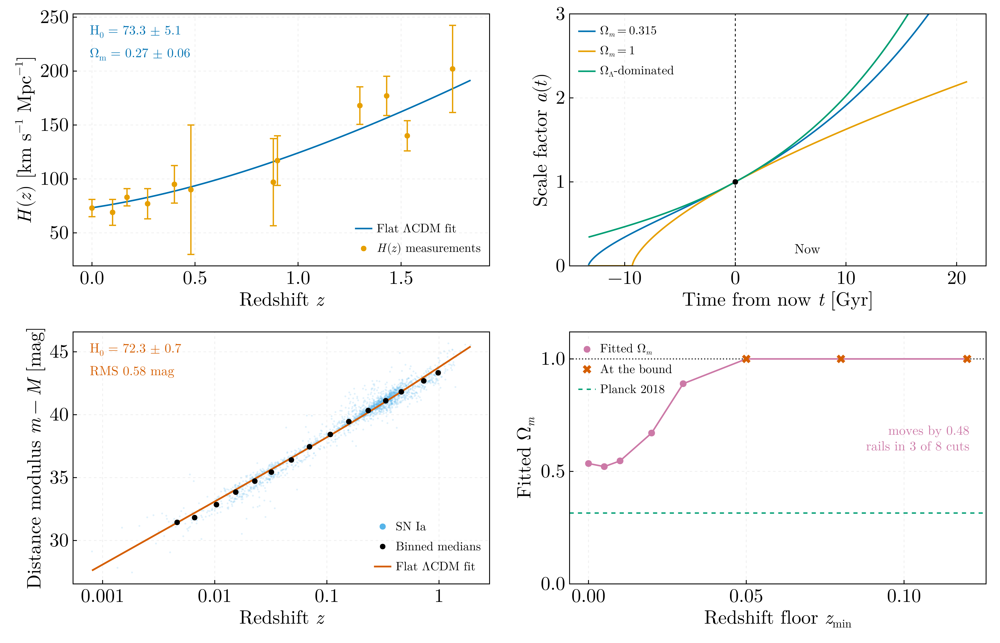

# Cosmology — JINR Dubna, July 2019

Joint work with [Alexandru Crăciun](https://github.com/Craciun-Alexandru),
presented as *"Numerical simulation of homogeneous and isotropic universe given
by Friedmann equations"* at the **Laboratory of Information Technology, JINR
Dubna, 25 July 2019**, supervised by Bijan Saha and Victor Rikhvitsky.

## `supernova_cosmology.jl`


**The accelerating universe, from the data the discovery was made with.**

Perlmutter et al. (1999), *Measurements of Ω and Λ from 42 High-Redshift
Supernovae*, ApJ **517**, 565 (astro-ph/9812133), Tables 1 and 2: 42 high-z SNe
Ia from the Supernova Cosmology Project and 18 low-z from Calán/Tololo, with
stretch-, K- and extinction-corrected effective B-band peak magnitudes.

The paper and its two data tables were sitting in the project folder, alongside
Riess et al. (1998) — the companion discovery — and were **never used**. The 2019
code fitted host-galaxy magnitudes instead.

| | Value |
|---|---|
| Ω_M, flat ΛCDM | **0.318 ± 0.086** |
| Published by the paper | 0.28 (+0.09 −0.08) |
| Agreement | **0.45σ** |
| Planck 2018, for context | 0.315 ± 0.007 |
| χ²/dof | 1.78 on 58 dof |

That is the validation: the implementation reproduces a published cosmological
parameter from the published data, rather than being checked only against
itself.

And the physics result. Holding Ω_M = 1 — the Einstein–de Sitter universe, flat
and matter-only, with no dark energy — costs **Δχ² = 33.6**. These sixty
supernovae reject a decelerating universe. That is the 1999 result and the 2011
Nobel Prize, reproduced from the paper's own table.

The lower panel is the one that matters: residuals against Einstein–de Sitter.
The high-redshift supernovae sit systematically **above** the line — fainter,
therefore further away than a decelerating universe allows.

## `friedmann_expansion.jl`



Flat ΛCDM fitted to two independent datasets, and the expansion history
integrated for three cosmologies.

### H(z)

| | Fitted | Planck 2018 |
|---|---|---|
| H₀ | **73.3 ± 5.1** km s⁻¹ Mpc⁻¹ | 67.4 ± 0.5 |
| Ω_m | **0.267 ± 0.064** | 0.315 ± 0.007 |

χ²/dof = 0.73 on 10 degrees of freedom, from **twelve** measurements of the
Hubble parameter. Both parameters agree with Planck inside the (large)
uncertainties of this small dataset; the central H₀ sits on the local-measurement
side of the Hubble tension, which is what H(z) compilations of this kind tend to
give.

### The SN Ia Hubble diagram

2376 Type Ia supernova distance moduli out to z = 1.91:

| | Fitted | Planck 2018 |
|---|---|---|
| H₀ | **72.33 ± 0.68** km s⁻¹ Mpc⁻¹ | 67.4 ± 0.5 |
| Ω_m | 0.535 ± 0.049 | 0.315 ± 0.007 |

Residual RMS 0.578 mag.

**H₀ is well determined and Ω_m is not, and the fit does not say so on its own.**
Ω_m comes back with a 9 % formal error, four sigma from Planck, and the only way
to see that the number is worthless is to move the sample. Raising a floor on
redshift walks it from 0.535 to the bound:

| z floor | N | H₀ | Ω_m |
|---|---|---|---|
| 0 | 2376 | 72.33 | 0.535 |
| 0.01 | 2308 | 72.11 | 0.547 |
| 0.02 | 2146 | 69.97 | 0.671 |
| 0.03 | 1993 | 66.78 | 0.890 |
| 0.05 | 1828 | 64.71 | **1.000 — at the bound** |
| 0.12 | 1650 | 64.18 | **1.000 — at the bound** |

Ω_m moves by 0.48 and rails in three of eight cuts, while H₀ drifts by 8 km s⁻¹
Mpc⁻¹ in the same direction — the two are degenerate, and the low-redshift
points are anchoring both. These are compiled distance moduli from mixed
sources, not a standardised sample: the distance scale survives the
heterogeneity and the shape does not. That is why standardised SN Ia compilations
exist, and the fourth panel is the honest way to report it.

The fit is bounded in Ω_m deliberately. Unbounded, a sample carrying no shape
information wanders off to unphysical values and still reports a confident error
bar; ending at a bound is the signal that the data do not constrain the
parameter, so the code returns that flag rather than hiding it.

### Host-galaxy magnitudes, for comparison

`Friedmann_Magnitude.jl` fitted 6571 host-galaxy apparent magnitudes, not
distance moduli. Refitting them gives an effective offset M = −19.57 with a
residual RMS of **1.35 mag** and Ω_m at its bound — against **0.578 mag** for the
distance moduli. Host-galaxy magnitudes are not standardised SN Ia peak
magnitudes, so they fix the distance scale and carry no cosmological information
at all. Kept because it is what the companion file actually did.

## Data

| File | Contents |
|---|---|
| `perlmutter1999_sn_ia.csv` | **60 standardised SN Ia**, z = 0.014–0.83, from the discovery paper |
| `hubble_parameter.csv` | 12 measurements of (z, H, σ_H) |
| `sn_ia_distance_moduli.csv` | 2376 SN Ia distance moduli, z = 0.0008–1.91 |
| `supernova_magnitudes.csv` | 6604 host-galaxy apparent magnitudes with redshifts |

`perlmutter1999_sn_ia.csv` is Tables 1 and 2 of astro-ph/9812133, transcribed
from the machine-readable tables that came with the paper.

`supernova_magnitudes.csv` is now **identified**: it is the Asiago Supernova
Catalogue, recovered as `sncat_latest_view.xls` in the project folder, last
saved by Victor Rikhvitsky on 17 July 2019 — the Dubna visit. Its columns
`sn_name`, `gal_mag`, `redshift` are columns 1, 6 and 11 of that catalogue, and
its first entries (1006A, 1054A) match.

`sn_ia_distance_moduli.csv` remains **unidentified**. It is Crăciun's reduction —
selected on `Method == "SNIa"`, deduplicated in redshift, sorted — but the
Asiago catalogue has neither a `Method` column nor a distance modulus, so it is
not the source. A redshift-independent distance compilation of the NED-D kind
fits the column set, but that is an inference. Its Ω_m instability should be
read as a property of an unidentified heterogeneous compilation, not as a result
about cosmology — which is exactly the contrast `supernova_cosmology.jl` draws.

## What changed from the original

**The original did not run.** `Friedmann_Eq.jl` called a function `Friedmann`
that was never defined — the definition present is
`FriedmannTimeDependentNeutralFluid` — and used `fit.param` some forty lines
before `fit` was assigned. It also declared

```julia
const G = 6.67408*1e-11        #Cosmological constant
```

which is the gravitational constant, not Λ. `Friedmann_Magnitude.jl` read its
data through a hardcoded `C:\Users\GoG\Desktop\...` path and, inside an ODE
right-hand side, wrote `u[3] = ...` — mutating the state vector instead of
returning a derivative.

The original fitted a **straight line** to H(z) (`LineFit(t, p) = p[1]*t .+ p[2]`);
flat ΛCDM is fitted here instead. The magnitude analysis is kept, but its route
is not: the original drove a `MonteCarloProblem` with randomised initial
conditions through `build_loss_objective`, which is replaced by the closed form
for the luminosity distance.

The equation-of-state survey sketched in the original's docstring —
quintessence, Chaplygin and modified Chaplygin gas — was never implemented
there, and is not implemented here either. It was not idle: the project folder
holds Jawad & Rani, *Constraining Parameters of Generalized Cosmic Chaplygin
Gas in Loop Quantum Cosmology* (arXiv:1409.7057) with its data table, and the
presentation sets out the barotropic equation of state `p = wε` for
w = 0, 1/3, −1/2, −1 — dust, radiation, quintessence and Λ — which is exactly
the `W = [-1, -1/2, 0, 1/3]` in `deqSolver.jl`. The intent and the source
material both survive; only the code does not. It is the obvious extension if
this module is ever taken further.

The comoving integral is tabulated once per trial Ω_m and interpolated rather
than integrated per supernova per iteration, which is what makes a 2376-point
fit and an eight-point stability sweep run in seconds.
