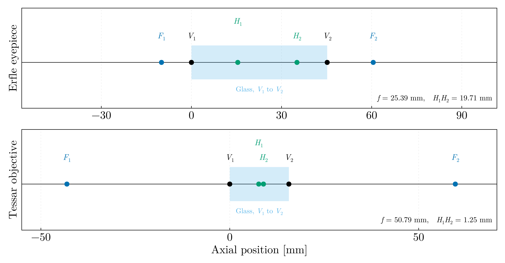
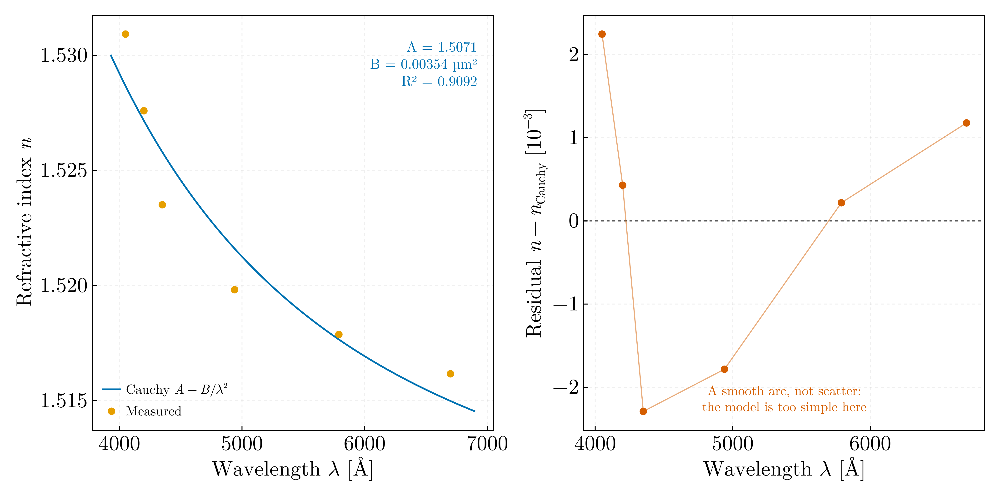

# Geometrical optics — BSc, year not recorded

Paraxial lens design ported from Octave, and prism dispersion from my own
goniometer readings.

## `paraxial_systems.jl`

Ray-transfer analysis of two classical designs, ported from `Erlfe.m` and
`Tessar.m` in `Code_Archive/Optics/` on the `legacy` branch. The ray state is
`[n·u ; y]` and the system matrix is accumulated from the last surface
backwards.

| | Erfle eyepiece | Tessar objective |
|---|---|---|
| Surfaces | 9 | 7 |
| Σd | 45.20 mm | 15.65 mm |
| Focal length | 25.39 mm | 50.79 mm |
| Front focal, from V₁ | 9.97 mm | 43.11 mm |
| Back focal, from V_N | 15.33 mm | 44.06 mm |
| H₁H₂ separation | 19.71 mm | 1.25 mm |

The script asserts the engine on a thin lens against the lensmaker formula
(f = 100.000000 mm, both principal planes at the vertex), the unit determinant
of each system matrix, and Newton's conjugate relation
(z₁ − z_F1)(z₂ − z_F2) = f² for an object at 2f of each design, object
distances counted to the left of V₁ and image distances to the right of V_N. The Tessar
comes out at 50.79 mm, a normal focal length for the 24 × 36 mm format.
"Erlfe" is a misspelling of Erfle, the 1921 wide-field eyepiece; the
nine-surface prescription is the six-element Type II form. `Tessar.m` is the
1902 Rudolph four-element design.

In the originals, `f = -1/S(1,2)` is labelled "Convergenta sistemului" — that
is the focal length; the convergence is P = 1/f = −S(1,2) — and the
principal-plane separation is written `sum(d) - abs(zH1) - abs(zH2)`, which
is right only when both principal planes fall on one side. The files' own
diagrams place H₁ at −zH1 and H₂ at Σd + zH2, so the separation is
Σd + zH1 + zH2; for these two prescriptions both zH1 and zH2 are negative and
the two formulae agree to the digit. `Tessar.m` notes in a comment that its
plot fails for an object at the front focal plane and does not guard it;
`conjugate` returns `Inf` there.

Both designs are strictly paraxial, as in the original: no real ray trace,
no aberrations, and a single refractive index per glass. The last is the real
limitation, since the cemented groups of both designs exist to achromatise,
and without dispersion data that cannot be evaluated. No aperture stop is
modelled, so the Tessar has no f-number.

## `prism_dispersion.jl`

Refractive index against wavelength for a prism, measured by minimum
deviation on a goniometer: six lines from 4050 to 6700 Å, with the two
goniometer readings on either side of the straight-through direction, the
minimum deviation and the index computed at the time. The readings are from a
first-year optics laboratory of mine; no code accompanied them. The analysis
exists because `msc/02-experimental-methods/hg_spectroscope_calibration.jl`
has to assume that a spectroscope drum reads linearly in refractive index,
whereas here the index is measured directly.

The script asserts that δ_min = (α₂ − α₁)/2 to round-off, that the n column is
reproduced from δ_min with the prism's apex angle of 59.9° to 3 × 10⁻⁶, and
that n falls with λ. The apex angle is the laboratory's value for its
equilateral glass prism and is taken as such; the second check verifies the
arithmetic of the column, not the prism.

| Fit | A | B [µm²] | Residual rms | Equivalent error in δ_min |
|---|---|---|---|---|
| Cauchy, two terms | 1.5071 ± 0.0026 | 0.00354 ± 0.00056 | 1.6 × 10⁻³ | 8.4′ (largest 12′) |
| Cauchy, three terms | 1.5228 ± 0.0053 | −0.0050 ± 0.0028 | 0.8 × 10⁻³ | 4.1′ |

The two-term residuals run + + − − + + across the series. A third term
halves them but returns B < 0, which no glass has, so the structure is read
as error in setting the minimum deviation — 8′ against a reading resolution
of 0.01°, which is 8 × 10⁻⁵ in n — rather than as a failure of the dispersion
model. B carries a 16 % uncertainty. Against N-BK7 from the Schott Sellmeier
coefficients the measured indices lie within −3.3 × 10⁻³ to +2.3 × 10⁻³, and
BK7's own two-term Cauchy coefficients over this range are A = 1.5046,
B = 0.00420 µm²: a crown glass of that class, not an identification.

## Data

| File | Content | Source |
|---|---|---|
| `prism_goniometer.csv` | Six lines: colour, λ [Å], α₁, α₂, δ_min [deg], n | My own goniometer readings from a first-year optics laboratory, on its bench goniometer and equilateral glass prism; the wavelengths are the nominal values of the lamp lines used |
