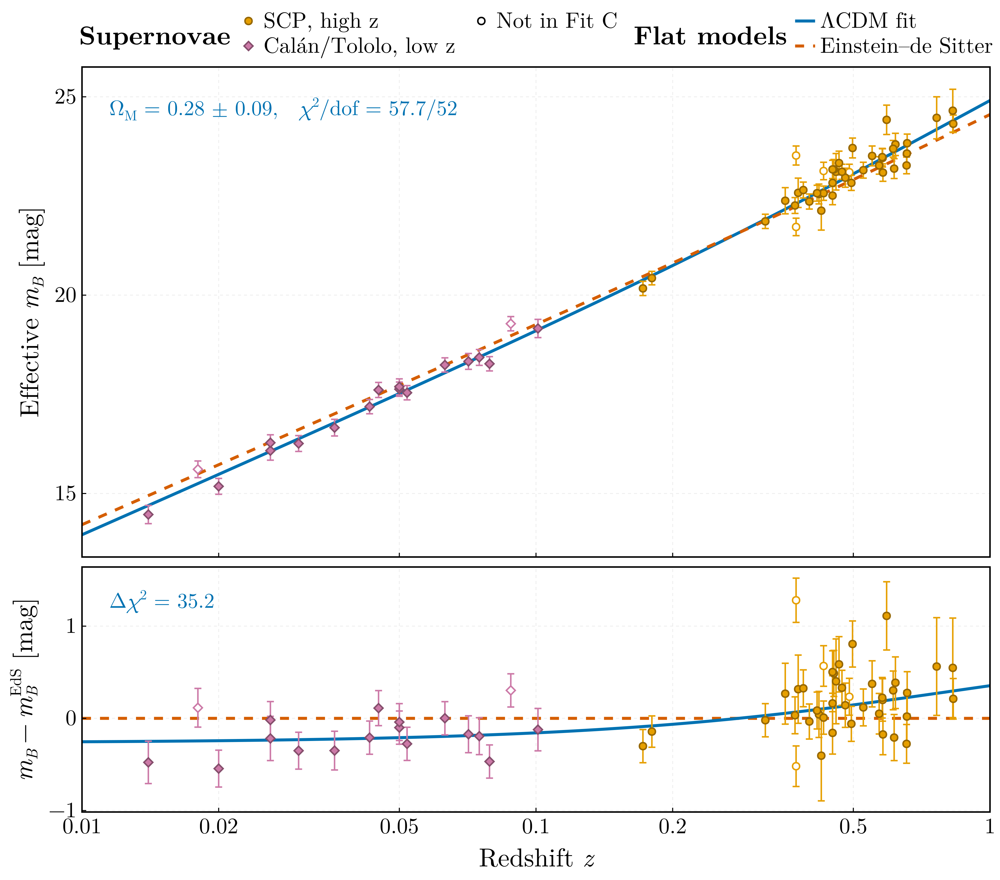

# Cosmology — JINR Dubna, July 2019

Joint work with [Alexandru Crăciun](https://github.com/Craciun-Alexandru),
presented as *Numerical simulation of homogeneous and isotropic universe given
by Friedmann equations* at the Laboratory of Information Technologies, JINR
Dubna, on 25 July 2019, under Bijan Saha and Victor Rikhvitsky. Two scripts on
the flat Friedmann–Lemaître universe, `H²(z) = H₀² [Ω_m (1+z)³ + 1 − Ω_m]`;
`cosmology_core.jl` holds the luminosity distance, the magnitude–redshift fit
and the closed-form expansion history they share. Both scripts assert their
results against closed forms or published values.

## `supernova_cosmology.jl`

Flat ΛCDM fitted to the sixty Type Ia supernovae of Perlmutter et al.,
*Measurements of Ω and Λ from 42 High-Redshift Supernovae*, ApJ **517**, 565
(1999), doi:10.1086/307221 — Tables 1 and 2: 42 high-redshift supernovae of the
Supernova Cosmology Project and 18 low-redshift ones of the Calán/Tololo
survey, with stretch-, K- and extinction-corrected effective B-band peak
magnitudes whose uncertainties include 0.17 mag of intrinsic dispersion. The
model is `m = 5 log₁₀[(1+z) ∫₀ᶻ dz′/E(z′)] + offset`; the absolute magnitude
and H₀ enter only through the offset, so two parameters are fitted, weighted by
the tabulated uncertainties.

Two samples are fitted: all sixty (the paper's Fit A) and the 54 of its primary
Fit C, which drops two residual outliers (1994H, 1997O), two stretch outliers
(1992bo, 1992br) and two probably reddened supernovae (1996cg, 1996cn), as
flagged in the tables' notes column.

| Sample | Ω_M, this fit | χ²/dof | Ω_M, published (Table 3) | χ²/dof, published |
|---|---|---|---|---|
| Fit A, 60 SNe | 0.318 ± 0.086 | 103.1/58 = 1.78 | 0.29 (+0.09 −0.08) | 98/56 |
| Fit C, 54 SNe | 0.283 ± 0.086 | 57.7/52 = 1.11 | 0.28 (+0.09 −0.08) | 56/50 |

The paper's fit is not this one: it has four parameters (Ω_M, Ω_Λ, the
magnitude zero point and the slope α of the width–luminosity relation),
propagates the redshift uncertainty, and reads its flat-universe Ω_M off the
Ω_M + Ω_Λ = 1 line of the two-dimensional confidence region. Landing inside the
published intervals, which the script asserts, is a consistency check of the
implementation rather than a reproduction. Scaled by √(χ²/dof) the errors
become ± 0.115 and ± 0.091; the excess of Fit A is the two residual outliers.
Planck 2018 gives Ω_m = 0.315 ± 0.007 (Planck Collaboration VI, A&A **641**, A6
(2020), doi:10.1051/0004-6361/201833910).

The Einstein–de Sitter universe, flat and matter-only, is fitted with the offset
alone: χ² = 136.8 on 59 dof for Fit A and 92.9 on 53 for Fit C, that is
Δχ² = 33.6 and 35.2 against ΛCDM for one extra parameter. Only flat models are
tested here, so what is rejected is flat matter-only expansion; open
decelerating models need the curvature term, which this module does not carry.
The lower panel shows the residuals against Einstein–de Sitter: the
high-redshift supernovae sit systematically above the line, fainter and
therefore more distant than a matter-only universe allows.

## `friedmann_expansion.jl`

**H(z).** Flat ΛCDM fitted to the twelve rows of `data/hubble_parameter.csv`,
weighted by their uncertainties. The z = 0 row is a local value of H₀, not a
measurement of H(z), so the fit is repeated without it; and the file has the
H values of the z = 0.48 and 0.88 rows interchanged with respect to the printed
table they come from (see Data), so it is repeated with them as printed.

| Rows | H₀ [km s⁻¹ Mpc⁻¹] | Ω_m | χ²/dof |
|---|---|---|---|
| 12, as in the file | 73.3 ± 5.1 | 0.267 ± 0.064 | 7.3/10 |
| 11, z > 0 | 73.5 ± 6.6 | 0.265 ± 0.076 | 7.3/9 |
| 12, rows 0.48 and 0.88 as printed | 73.3 ± 5.1 | 0.266 ± 0.064 | 7.6/10 |

Both parameters agree with Planck 2018 (67.4 ± 0.5, 0.315 ± 0.007) within the
uncertainties of a twelve-point dataset.

**a(t).** The Friedmann equation integrated with the scale factor as the
independent variable, `dt/da = 1/(aH)`, which is regular at a = 0 and so
reaches the Big Bang instead of stepping through it, for Ω_m = 0.315, 1 and
0.05 at the Planck H₀. The integrated t(a) is asserted against the closed form
`(2 / 3√Ω_Λ) asinh(√(Ω_Λ/Ω_m) a^{3/2}) / H₀` to 4 × 10⁻¹⁰ of the Hubble time
along the whole history, and the age at the Planck parameters, 13.796 Gyr,
against the Planck value 13.797 ± 0.023 Gyr. The Einstein–de Sitter age is
9.67 Gyr and the Ω_m = 0.05 one 21.6 Gyr.

**SN Ia distance moduli.** 2376 Type Ia distance moduli out to z = 1.91, fitted
unweighted because the reduction kept no uncertainties, and refitted above a
rising redshift floor:

| z floor | N | H₀ [km s⁻¹ Mpc⁻¹] | Ω_m | RMS [mag] |
|---|---|---|---|---|
| 0 | 2376 | 72.33 ± 0.68 | 0.535 ± 0.049 | 0.578 |
| 0.005 | 2352 | 72.58 ± 0.68 | 0.521 ± 0.048 | 0.571 |
| 0.01 | 2308 | 72.11 ± 0.69 | 0.547 ± 0.050 | 0.561 |
| 0.02 | 2146 | 69.97 ± 0.77 | 0.671 ± 0.060 | 0.554 |
| 0.03 | 1993 | 66.78 ± 0.87 | 0.890 ± 0.079 | 0.540 |
| 0.05 | 1828 | 64.71 ± 0.37 | 1, at the bound | 0.528 |
| 0.08 | 1725 | 64.26 ± 0.37 | 1, at the bound | 0.515 |
| 0.12 | 1650 | 64.18 ± 0.38 | 1, at the bound | 0.515 |

H₀ is well determined and Ω_m is not, and the formal errors do not say so:
Ω_m comes back with a 9 % error four standard deviations from Planck, moves by
0.48 across the cuts and rails at the physical bound in three of eight, while
H₀ drifts by 8 km s⁻¹ Mpc⁻¹ in the same direction. The two are degenerate and
the low-redshift points anchor both. These are distance moduli compiled from
mixed sources and methods, not a standardised sample: the distance scale
survives the heterogeneity and the shape does not. The fit is bounded to
0 ≤ Ω_m ≤ 1 deliberately; ending at a bound is the signal that the data do not
constrain the parameter, and the code reports it as such rather than a number
with an error bar.

**Host-galaxy magnitudes.** The 6571 host-galaxy apparent magnitudes that the
2019 analysis fitted give Ω_m at the bound, an effective offset M = −19.57 mag
and a residual RMS of 1.35 mag, against 0.58 mag for the distance moduli.
Host-galaxy magnitudes are not standard candles; they fix an offset and carry
no cosmological information.

## Data

| File | Content | Source |
|---|---|---|
| `perlmutter1999_sn_ia.csv` | 60 SNe Ia: z, σ_z, effective m_B, σ, sample | Tables 1 and 2 of Perlmutter et al. (1999), doi:10.1086/307221, from the machine-readable tables; three designations that the tables had rendered as digits are written as printed in the paper (1997I, 1997O, 1993O), no value differs |
| `hubble_parameter.csv` | 12 rows of z, H(z), σ_H | Eleven rows coincide in z and H with Table 2 of Stern et al., JCAP **02** (2010) 008, doi:10.1088/1475-7516/2010/02/008, except that the H values at z = 0.48 and 0.88 are interchanged and three uncertainties carry an extra decimal (17.4, 40.4, 18.2 where the table prints 17, 40, 18); the z = 0 row, 73 ± 8, is a local H₀ value. Assembled in 2019; the immediate source of the transcription is not recorded |
| `sn_ia_distance_moduli.csv` | 2376 rows of m − M and z | Crăciun's reduction of the NED-D compilation of redshift-independent distances (Steer et al., AJ **153**, 37 (2017), doi:10.3847/1538-3881/153/1/37; https://ned.ipac.caltech.edu/Library/Distances/): rows with method SNIa, one per redshift, sorted; no uncertainties were kept, and the NED-D version downloaded in July 2019 is not recorded |
| `supernova_magnitudes.csv` | 20 585 rows of SN name, host-galaxy magnitude, z | Extract of the SAI Supernova Catalogue, Sternberg Astronomical Institute (Tsvetkov, Pavlyuk and Bartunov, Astron. Lett. **30**, 729 (2004), doi:10.1134/1.1819491; http://stella.sai.msu.ru/sncat/), columns SN, host magnitude and redshift; the version downloaded in 2019 is not recorded. The catalogue also lists the supernova magnitude at maximum, which the 2019 extract did not take |

## The 2019 code

Ported from `Friedmann_Eq.jl` and `Friedmann_Magnitude.jl` in
`Julia-Workflow-FFUB/Dubna_2019_Cosmology/` on the `legacy` branch, with
`goodData.csv` (the H(z) rows) and `Data.csv` (the SAI extract) beside them.

`Friedmann_Eq.jl` does not run top to bottom: its first plot uses `fit.param`
some forty lines before `fit` is assigned, and its time-dependent system calls a
function `Friedmann` that is never defined (the definition present is
`FriedmannTimeDependentNeutralFluid`). It declares
`const G = 6.67408*1e-11 #Cosmological constant`, which is the gravitational
constant, and mixes it, in SI units, with H in km s⁻¹ Mpc⁻¹ inside the same
right-hand side. Its H(z) analysis is a straight-line fit,
`LineFit(t, p) = p[1]*t .+ p[2]`; flat ΛCDM is fitted here instead.

`Friedmann_Magnitude.jl` reads its data from an absolute Windows path, and
inside the right-hand side of its ODE writes `u[3] = …`, assigning a magnitude
into the state vector instead of returning a derivative. It fitted host-galaxy
magnitudes by driving a `MonteCarloProblem` with randomised initial conditions
through `build_loss_objective`; the closed form of the luminosity distance
replaces that route. The equation-of-state survey sketched in its docstring —
quintessence, Chaplygin and modified Chaplygin gas — was never implemented and
is not implemented here.
