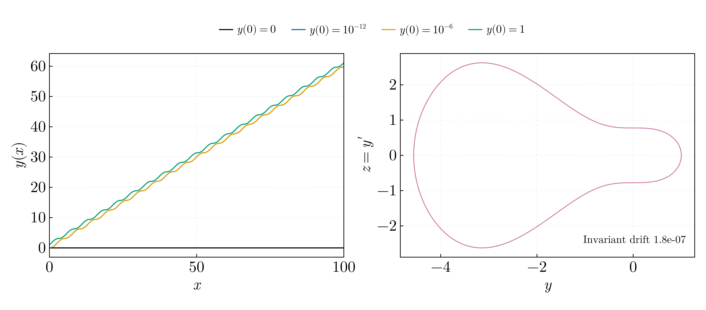
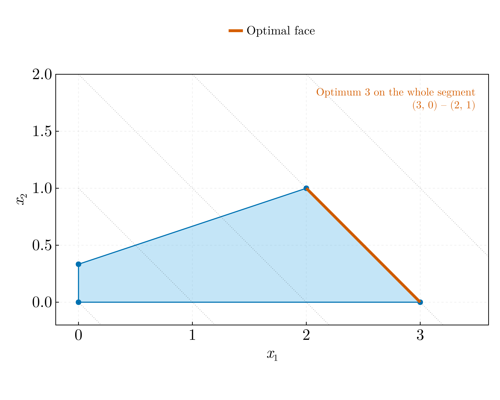

# Numerical methods II — 2021

Fourth-year exam problems.

## `nonunique_ivp_and_rk4.jl`



**The first problem is not well posed as its own comment states it.** The file
is headed `y' = √|sin y|, y(0) = 0`, but √|sin y| is not Lipschitz at y = 0 — its
derivative diverges — so Picard–Lindelöf does not apply and uniqueness fails.

| Initial value | y(100) |
|---|---|
| 0 | 0.000000 |
| 10⁻¹² | 59.736912 |
| 10⁻⁶ | 59.741062 |
| 1 | 61.130108 |

All four are legitimate solutions of the same initial-value problem. A
perturbation of 10⁻¹² changes the answer by sixty. No numerical method can
choose between them, and the 2018 code quietly set `y[1] = 1`, contradicting its
own stated initial condition and stepping around the issue.

The second problem, `y' = z, z' = -y sin y`, is conservative; the invariant
`z²/2 + sin y - y cos y` drifts by 1.8 × 10⁻⁷ over 5000 RK4 steps. The original
integrated it correctly but called its stepper twice per step, once per
component, doing double the work and discarding half of each result.

## `nonlinear_schrodinger_mol.jl`


The focusing nonlinear Schrödinger equation `i∂ₜΨ = -½∂ₓₓΨ - |Ψ|²Ψ` by the
method of lines, on the original's two-soliton initial condition.

A soliton carrying the phase factor `e^{ikx}` travels with velocity `v = k`, so
the original's pair — centred at x = ∓5 with k = ∓0.1 — moves **apart**, not
together. On the periodic domain [−10, 10] they reach the boundary, meet there,
pass through one another and separate again, which is what the heatmap shows.

The norm `∫|Ψ|²dx` is conserved to a relative **8 × 10⁻¹⁵** over 625 000 steps.
That is the check the port exists for: the 2018 stages were

```julia
k2 = Sⁿ(Ψⱼ₋₁ + dt*k1/2, Ψⱼ + dt*k1/2, Ψⱼ₊₁ + dt*k1/2, dx)
```

perturbing all three stencil neighbours by the *same* increment — the one
belonging to the centre point. In the method of lines a stage must be formed on
the whole solution vector and the spatial operator applied to that. It was also
a three-stage scheme named `RungeKutta3`.

## `linear_program.jl`



`max x₁ + x₂` subject to `x₁ + x₂ ≤ 3`, `-x₁ + 3x₂ ≤ 1`, `x₂ ≤ 3`, `x ≥ 0`,
solved by vertex enumeration.

Two things the original hid behind a solver call:

- **The problem is degenerate.** The objective is exactly parallel to the first
  constraint, so the optimum 3 is attained on the *whole segment* from (3, 0) to
  (2, 1). The original printed `value(x1)` and `value(x2)` as though the answer
  were a unique point; which vertex a simplex returns is arbitrary.
- **`x₂ ≤ 3` is redundant**, implied by `x₁ + x₂ ≤ 3` with `x₁ ≥ 0`. It is active
  at no feasible vertex.

It is replaced rather than repaired: `Model(with_optimizer(GLPK.Optimizer))` was
removed from JuMP in 0.22 (2021), so the original raises `UndefVarError` on any
current version — and for two variables, enumeration is exact and needs no
dependencies.
