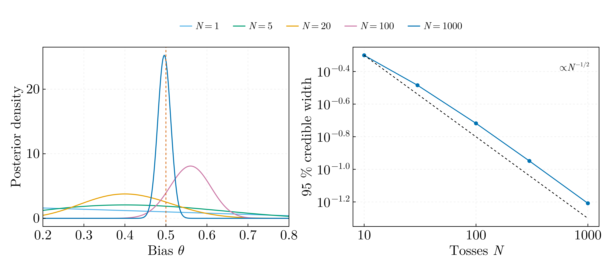
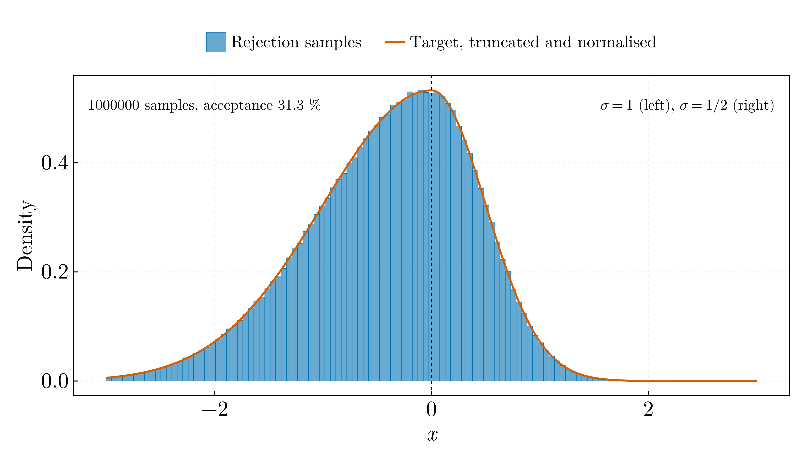

# Bayesian statistics and Monte Carlo — 2021

## `bayesian_coin_updating.jl`

Conjugate Beta–Bernoulli updating of a coin's bias. After 1000 tosses the
posterior mean is 0.4960 against a true 0.5, with a 95 % credible interval of
width 0.062, and the interval narrows as **N^−0.454** against the asymptotic
N^−1/2.

The statistics in `Statis.jl` were right; the presentation was the problem. The
original wrote a 1001-frame animation at 1280×900 that came to **14.6 MB** —
larger than every other file in the repository combined — and carried a plot
title, which this project's figures do not use. The credible interval and its
scaling are new: the original showed the posterior narrowing but never
quantified it.

## `rejection_sampling.jl`

Von Neumann rejection sampling from an asymmetric bi-Gaussian, σ = 1 below zero
and σ = 1/2 above. The measured acceptance rate is 0.3127 against the analytic
0.3128, and the sample mean −0.39345 against −0.39374 by quadrature.

Corrections to `MonteCarloDistribution.jl`:

- it defined `function Distribution(x)` after `using Distributions`, which
  exports the abstract type `Distribution`. On Julia ≤ 1.11 that was a hard
  error; on 1.12+ it is a deprecation warning and silently *extends*
  `Distributions.Distribution` rather than defining a new function
- `contor` started at 1 and was incremented before the acceptance test, so
  `contor/Np` reported the reciprocal of the efficiency — and as a bare
  top-level expression it printed nothing when run as a script
- the proposal support [−3, 3] truncates the tails without renormalising. That
  discards 0.18 % of the true mass, so the sampled density is the truncated one;
  it is now stated and quantified rather than silent
- no seed, and `rand(Uniform(-3,3))` rebuilt the distribution object on each of
  ~1.8 million iterations
