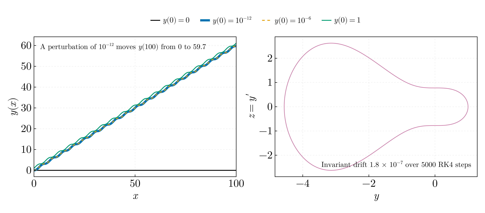
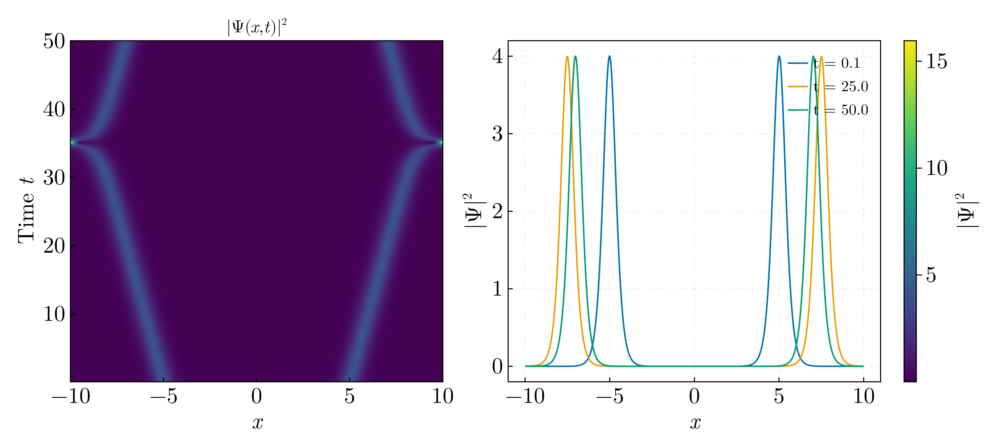
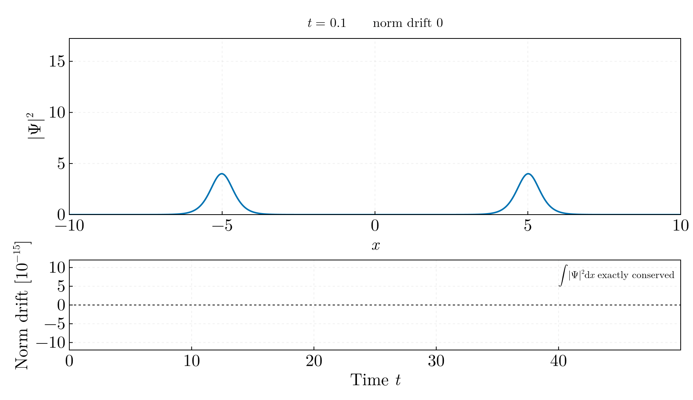
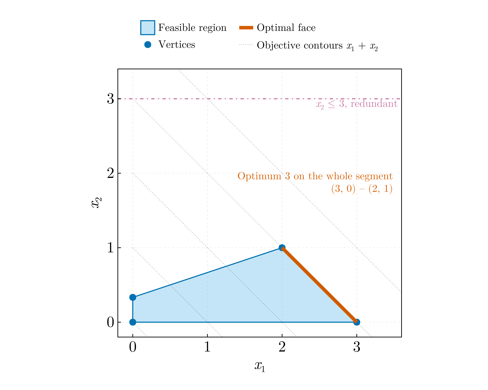

# Numerical methods II — BSc year 4 (2020–2021)

Three problems from the fourth-year numerical-methods examination: a scalar
initial-value problem without a unique solution, the focusing nonlinear
Schrödinger equation by the method of lines, and a two-variable linear
program. The originals are `ODE_RK4.jl`, `ODE_system_RK4.jl` and
`SolitonicEq_MOL.jl` in `Julia-Workflow-FFUB/Numerical_Methods_II_Exam_L_4/` and
`MaximizeLinearSystemEq.jl` in `Julia-Workflow-FFUB/Single_Files/` on the
`legacy` branch.

## `nonunique_ivp_and_rk4.jl`



**(a)** y′ = √|sin y| on 0 ≤ x ≤ 100 by RK4. The right-hand side vanishes with
infinite slope at every multiple of π, so it is not Lipschitz there and the
initial-value problem has no unique solution from y(0) = 0, which is how the
original file states the problem: y ≡ 0 solves it, and so does every solution
that waits at 0 for an arbitrary time before leaving. The file itself starts
from y(0) = 1, which moves the same ambiguity to the first crossing of π.
Away from the zeros the equation separates, and the solution that never waits
crosses each multiple of π after the finite time
T₁ = ∫₀^π dy/√(sin y) = √π Γ(¼)/Γ(¾) = 5.2441, which the script asserts by
quadrature. Inverting x(y) gives that solution to full precision, and RK4 is
measured against it:

| y(0) | Reference y(100) | RK4, h = 0.1 | h = 0.02 | h = 0.00125 |
|---|---|---|---|---|
| 0 | 0, or any waiting solution | 0.0000 | 0.0000 | 0.0000 |
| 10⁻¹² | 59.7230 | 60.0280 | 59.7369 | 59.7241 |
| 10⁻⁶ | 59.7233 | 60.0280 | 59.7411 | 59.7246 |
| 1 | 61.0366 | 61.8821 | 61.1301 | 61.0442 |

Started exactly at 0, RK4 stays at 0, as the script asserts; started at any
positive value it follows the never-waiting solution, but at each of the
nineteen crossings of kπ that solution is only C¹, y″ jumping by 1, so the
scheme loses its order there. Between the two finest steps y(100) still moves
by 0.003 (from 10⁻¹²) and 0.016 (from 1): the second decimal is not
converged at h = 0.00125, and at the original's h ≈ 0.1 the values are off
by 0.3 and 0.8.

**(b)** y′ = z, z′ = −y sin y, y(0) = 1, z(0) = 0. The invariant
z²/2 + sin y − y cos y drifts by 1.8 × 10⁻⁷ over 5000 RK4 steps of 0.02,
asserted below 10⁻⁶. The original integrated the system correctly but called
its stepper twice per step, once per component, and discarded half of each
result.

## `nonlinear_schrodinger_mol.jl`





The focusing nonlinear Schrödinger equation i∂ₜΨ = −½∂ₓₓΨ − |Ψ|²Ψ by the
method of lines: a periodic grid of 1000 points on [−10, 10), dx = 0.02, a
second-order centred stencil, RK4 with dt = 8 × 10⁻⁵ to t = 50 (625 000
steps), on the original's two-soliton initial condition, amplitude 2 at
x = ∓5 with wavenumbers ∓0.1.

A soliton η sech(η(x − x₀)) e^{ikx} of this equation travels with velocity
v = k, so the pair moves apart and meets across the periodic boundary; the
speed of the left peak over 2 ≤ t ≤ 20, from a linear fit to its parabolically
interpolated position, is −0.1000, asserted within 3 % of −0.1. The norm
∫|Ψ|² dx is conserved to a relative 2.5 × 10⁻¹⁴ over the run, asserted below
10⁻¹²; the Hamiltonian ∫(½|∂ₓΨ|² − ½|Ψ|⁴) dx, which RK4 does not conserve
exactly, drifts by 1.6 × 10⁻¹⁰. The peaks coincide at t = 35.0 rather than the
t = 50 that |v| = 0.1 over five units on each side would give: the tails reach
across the boundary long before the peaks and two in-phase solitons attract.
At the encounter |Ψ|² reaches 15.7, four times the isolated peak, and both
pulses leave with the shape and speed they arrived with. The animation shows
the passage, with the norm drift tracked beneath.

In the original the stages perturbed all three stencil neighbours by the same
increment, the one belonging to the centre point,

```julia
k2 = Sⁿ(Ψⱼ₋₁ + dt*k1/2, Ψⱼ + dt*k1/2, Ψⱼ₊₁ + dt*k1/2, dx)
```

whereas a method-of-lines stage is formed on the whole solution vector before
the spatial operator is applied; the scheme was a three-stage one named
`RungeKutta3`; and dx = 0.5 put about one grid point across a soliton of
width 0.5.

## `linear_program.jl`



max x₁ + x₂ subject to x₁ + x₂ ≤ 3, −x₁ + 3x₂ ≤ 1, x₂ ≤ 3, x ≥ 0, solved by
enumerating the vertices of the feasible region. Two things a solver call
hides:

- **the problem is degenerate.** The objective is parallel to the first
  constraint, so the optimum 3 is attained on the whole segment from (3, 0)
  to (2, 1); the script asserts a two-vertex optimal face at the bound of that
  constraint. The original printed `value(x1)` and `value(x2)` as though the
  answer were a point; which vertex a simplex returns is arbitrary
- **x₂ ≤ 3 is redundant**, implied by x₁ + x₂ ≤ 3 with x₁ ≥ 0; it is active at
  no feasible vertex

The original called JuMP through `Model(with_optimizer(GLPK.Optimizer))`,
removed in JuMP 0.22, and raises `UndefVarError` on any current version. For
two variables enumeration is exact and needs no dependencies, so it is
replaced rather than repaired.
