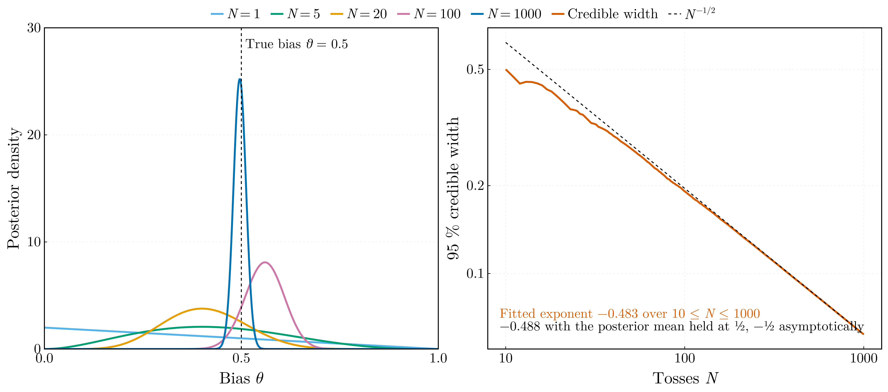
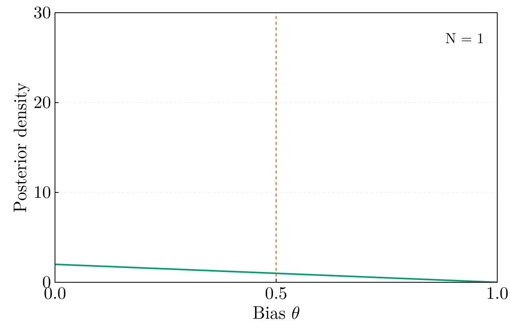
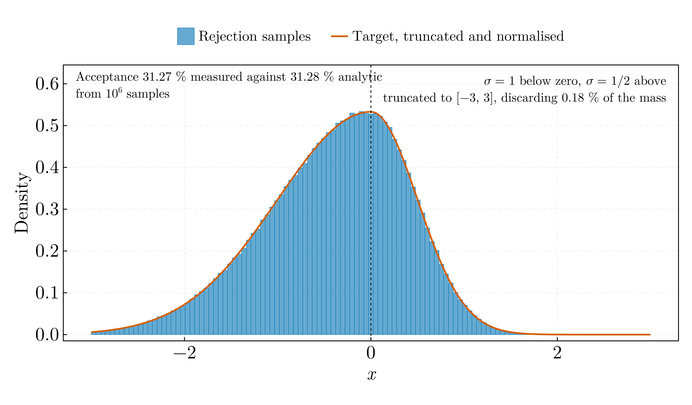

# Bayesian statistics and Monte Carlo — BSc year 4 (2020–2021)

## `bayesian_coin_updating.jl`

Conjugate Beta–Bernoulli updating of the bias of a coin over 1000 tosses of a
fair coin from a fixed seed. After 1000 tosses, 496 heads: posterior mean
0.4960, 95 % credible interval [0.4651, 0.5270], width 0.062.

The width of the interval is that of the normal approximation,
2 z₀.₉₇₅ √(θ̂(1 − θ̂)/(N + 3)) with θ̂ the posterior mean, asserted within
3 % at N = 10 and 1 % at N = 1000, so it narrows as N^{−1/2} only
asymptotically. Over 10 ≤ N ≤ 1000 the fitted exponent is −0.483; the same
fit with the posterior mean held at ½ gives −0.488, so the +3 of the flat
prior accounts for most of the departure from −½ and the wandering of the
posterior mean along the sequence for the rest.

Ported from `Statistics.jl` in `Julia-Workflow-FFUB/Statistics_Simulation_L_4/` on the
`legacy` branch, whose statistics were right. Its animation was 1001 frames at
1280 × 900, 14.6 MB; the one here shows every tenth toss. The credible
interval and its scaling are not in the original.

## `rejection_sampling.jl`

Von Neumann rejection sampling from the asymmetric bi-Gaussian
f(x) = exp(−x²/2) for x < 0 and exp(−2x²) for x ≥ 0, against a uniform
proposal on [−3, 3] with envelope 1, 10⁶ accepted samples from a fixed seed.
The acceptance rate is 0.3127 against the analytic 0.3128, 0.2 standard errors
away, and the sample mean −0.39345 against −0.39374 by quadrature, 0.4
standard errors away; both are asserted within four.

Corrections to `MonteCarloDistribution.jl` in `Julia-Workflow-FFUB/Single_Files/`
on the `legacy` branch:

- it defined `function Distribution(x)` after `using Distributions`, which
  exports the abstract type `Distribution`. On Julia ≤ 1.11 that was a hard
  error; on 1.12+ it is a deprecation warning and silently extends
  `Distributions.Distribution` rather than defining a new function
- `contor` started at 1 and was incremented before the acceptance test, so
  `contor/Np` reported the reciprocal of the efficiency, and as a bare
  top-level expression it printed nothing when run as a script
- the proposal support [−3, 3] truncates the tails without renormalising,
  discarding 0.18 % of the mass, nearly all of it on the σ = 1 side; the
  sampled density is the truncated one, which is now stated and quantified
- no seed, and `rand(Uniform(-3,3))` rebuilt the distribution object on each
  of some three million trials
