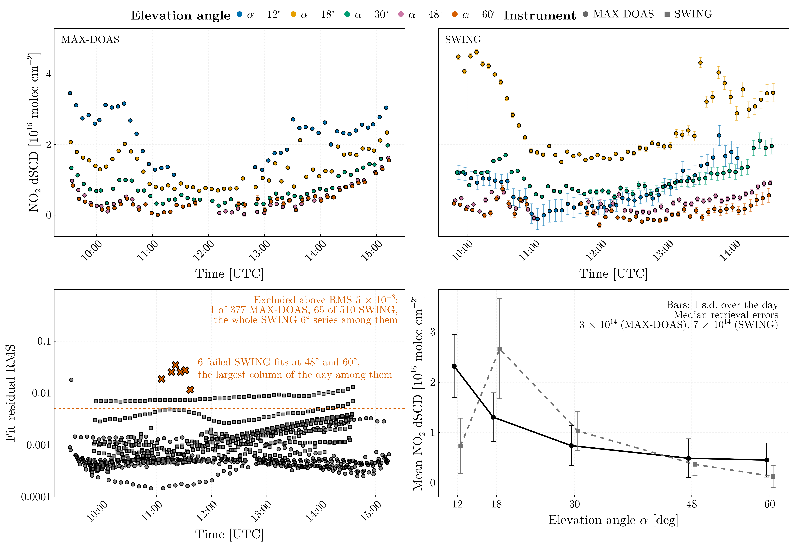

# Remote sensing — DOAS, BSc year 4 (2020–2021)

NO₂ differential slant column densities (dSCD) retrieved by DOAS from two
instruments operated side by side on the ground on 18 March 2019, at the
position the files record as 44° N, 28° E with viewing azimuth 185°: a
MAX-DOAS scanning the elevations 3, 6, 12, 18, 30, 48, 60 and 89°, and SWING,
the BIRA-IASB whiskbroom imaging spectrometer built for UAV operation
(Merlaud et al. 2018, doi:10.5194/amt-11-551-2018), here on the ground beside
the MAX-DOAS, stepping its servo from 60° down to 6° in steps of 6°. Both
retrievals are QDOAS output (BIRA-IASB, https://uv-vis.aeronomie.be/software/QDOAS/),
NO₂ fitted jointly with O₃, O₄, H₂O and the Ring pseudo-absorber, with the fit
residual RMS and the retrieval error of every column alongside.

Fits with residual RMS above 5 × 10⁻³ are excluded. The cut keeps 376 of 377
MAX-DOAS and 445 of 510 SWING spectra, and it is not neutral between the
instruments: every SWING spectrum at 6° has RMS between 7 and 13 × 10⁻³, so
the whole SWING 6° series goes, together with the 12° spectra after 14:00 and
six spectra at 48° and 60°. The comparison therefore covers the five
elevations both instruments hold with at least five accepted spectra:

| Elevation | MAX-DOAS ⟨dSCD⟩ | Spread | SWING ⟨dSCD⟩ | Spread |
|---|---|---|---|---|
| 12° | 2.32 | 0.63 | 0.74 | 0.55 |
| 18° | 1.31 | 0.48 | 2.67 | 0.99 |
| 30° | 0.74 | 0.40 | 1.03 | 0.39 |
| 48° | 0.49 | 0.38 | 0.37 | 0.23 |
| 60° | 0.46 | 0.34 | 0.13 | 0.22 |

in 10¹⁶ molec cm⁻²; the spread is one standard deviation over the day. The
MAX-DOAS means fall monotonically with elevation, as the shortening slant path
requires, and the script asserts it. The SWING means do so from 18° upwards;
its 12° mean is a third of the 18° one, with a retrieval error three times
that of the other elevations, and its 6° series did not survive the cut at
all, so SWING's two lowest elevations do not reproduce the MAX-DOAS series.
The median retrieval errors are 3 × 10¹⁴ (MAX-DOAS) and 7 × 10¹⁴ molec cm⁻²
(SWING), an order of magnitude below the spread over the day: the bars in the
lower-right panel are the day's variability, not the fit.

Six SWING fits at 48° and 60° between 11:05 and 11:37 fail with RMS
0.012–0.035 and columns 3 to 51 times the medians of their elevation angles;
the largest SWING column of the day, 6.2 × 10¹⁶ molec cm⁻² at 60° at 11:20,
is one of them and carries a retrieval error of 37 %. Without the cut they
read as a tenfold NO₂ excess at high elevation lasting half an hour. The 18°
and 24° columns of 1–2 × 10¹⁶ in the same window are three to four times
their medians and survive; that is the elevated NO₂ of the late morning.

Corrections to `SWING_DOAS.jl` in `Julia-Workflow-FFUB/Teledetectie_L_4/` on
the `legacy` branch:

- the plotted quantity was labelled "Concentratie NO₂" without units; it is a
  differential slant column density in molec cm⁻²
- `NO2.SlErr` was never read, so the series carried no error bars
- no quality filter was applied
- `88 - servo_byte` was an undocumented constant, and the column kept the name
  `…position_byte` after becoming degrees. It puts the bytes 28, 34, …, 82 on
  the 6° grid of the MAX-DOAS sequence and is kept as the original's, named
  and documented as empirical
- time was rebuilt from the fractional-hour column with a rounding that
  produced `hh:mm:60` on seven rows; it is now read from the files' own
  hh:mm:ss column, asserted against the fractional hours to one second.
  `savefig` used a Windows separator into a directory that does not exist,
  so on Linux the original wrote files literally named `Grafice\MaxDoas.png`

No air-mass factors are applied, so the dSCD are not converted to vertical
columns, and the MAX-DOAS 3°, 6° and 89° series are not compared for lack of
an accepted SWING counterpart.

## Data

| File | Content | Source |
|---|---|---|
| `MAXDOAS.csv` | 377 QDOAS NO₂ fit results, 09:25–15:14 UTC, tab-separated: date and time, position, elevation and azimuth, fit RMS, slant columns and errors of NO₂, O₃, O₄, H₂O and Ring, shift and stretch | Retrieval output supplied with the fourth-year remote-sensing laboratory; the MAX-DOAS instrument, its operator and the QDOAS settings are not recorded in this repository |
| `SWING.csv` | 510 QDOAS NO₂ fit results, 09:46–14:35 UTC, with scans, integration time, servo byte and temperatures | Same provenance; the instrument is SWING, operated on the ground beside the MAX-DOAS |
