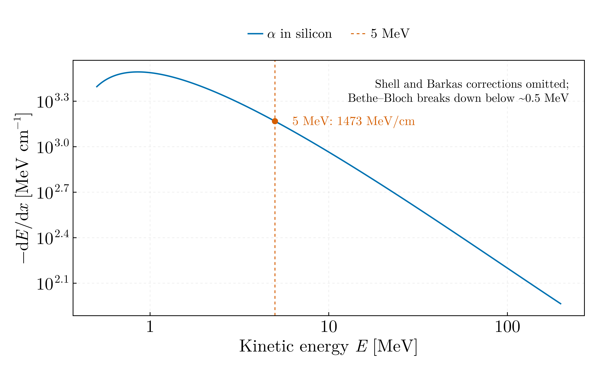
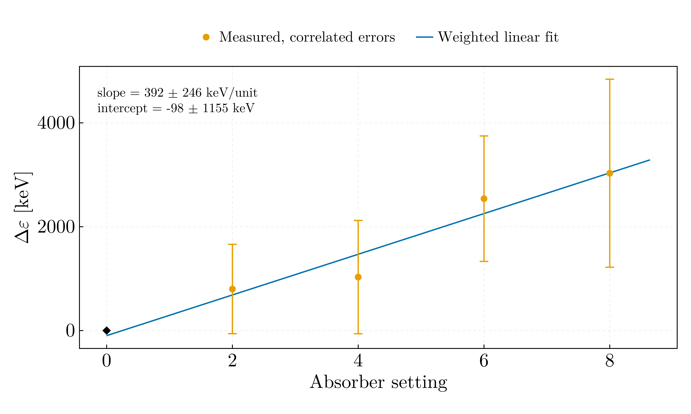
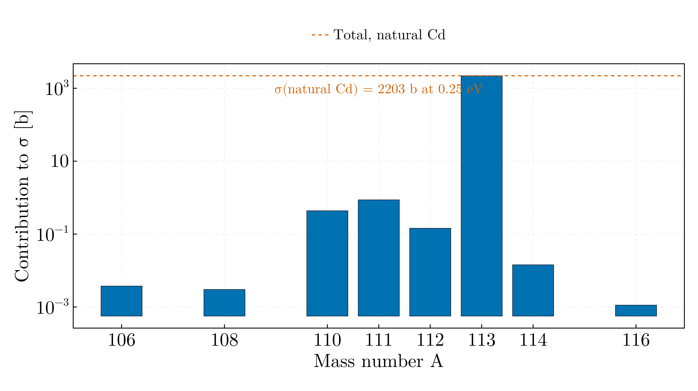
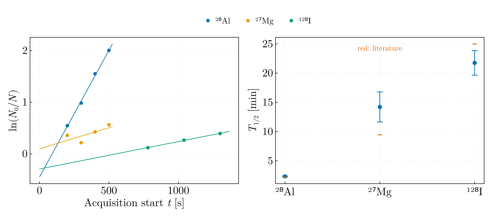

# Interaction of radiation with matter — MSc year 1

## `bethe_bloch_stopping_power.jl`

Electronic stopping power of a 5 MeV α in silicon: **1473 MeV cm⁻¹**, or
632 MeV cm² g⁻¹, with I = 172.3 eV from the Sternheimer–Barkas parametrisation.

Integrating 1/(dE/dx) gives a CSDA range of **21.6 µm** from 0.5 MeV, against a
full range of about 25 µm for a 5 MeV α in silicon. The deficit is the
sub-0.5 MeV portion, where the Bethe logarithm turns over and the formula stops
describing the physics — the shell and Barkas corrections it omits are no longer
small at β = 0.052.

The formula was transcribed correctly in 2018. What was missing was context: the
target material is named nowhere in the file, A was written as 28 rather than
28.085, and the log argument typed the same sub-expression twice instead of
squaring it, hiding that the second factor is W_max.

## `alpha_attenuation_mylar.jl`

Energy loss of α particles through stacked Mylar foils, fitted with the **full
covariance** — every Δε shares the same reference measurement ε₀, so the points
are correlated and treating them as independent understates the slope error.

Slope 392 ± 246 keV per absorber unit, intercept −98 ± 1155 keV, which is 0.08σ
from the zero it must be by construction. χ² = 0.30 on 2 dof.

The original fitted **unweighted** while drawing error bars that therefore did
not enter the χ², never called `stderror`, and never printed the coefficients —
its only output was a figure.

A caveat on the abscissa, labelled "x (μm)" in 2018: the fitted slope is
392 keV per unit, while the tabulated electronic stopping power of Mylar near
4 MeV is ≈150 keV/µm, and a 1.85 MeV residual after 8 µm cannot be reconciled
with the ≈30 µm range of a 4.9 MeV α. The abscissa is more likely a foil count
than a length. It is left as supplied and labelled neutrally.

## `natural_cd_cross_section.jl`

Abundance-weighted neutron capture cross-section of natural cadmium:
**2203 b at 0.25 eV**, of which **¹¹³Cd alone supplies 99.93 %** through its
0.178 eV resonance.

Carrying the energy into the result is the point. The conventional number for
natural Cd is 2520 b at the 2200 m s⁻¹ thermal point (0.0253 eV, where
σ(¹¹³Cd) = 20 600 b), and a reader seeing a bare "2203 b" will assume that is
what is meant. The original **never printed the result at all** — a bare
top-level expression, so running the file produced no output — and its arrays
were positional, with nothing tying σ = 18 000 b to ¹¹³Cd.

## `neutron_activation_halflives.jl`

Three activation products from the linearised decay law, weighted with the full
Poisson covariance including the correlation through the shared reference count.

| Product | Measured T½ | Literature | Agreement |
|---|---|---|---|
| ²⁸Al | 2.354 ± 0.076 min | 2.245 | 1.4σ |
| ²⁷Mg | 14.23 ± 2.57 min | 9.458 | 1.9σ |
| ¹²⁸I | 21.76 ± 2.09 min | 24.99 | 1.5σ |

The NaI(Tl) energy calibration puts the studied peak at **441.1 ± 12.1 keV**;
¹²⁸I emits a γ at 442.9 keV, a 0.15σ identification. It is an extrapolation —
the lowest calibration point is channel 77 and the peak is at 67 — which the
original did not say, and it reported the energy with no uncertainty at all
although it is what identifies the nuclide.

`ReactiiNeutronice.jl` fitted with **no weights** and never called `stderror`,
so it printed half-lives as bare numbers with no uncertainty, while its sibling
weighted the identical kind of data. Where weights were used they were `wt = N`,
implying Var[ln(N₀/N)] = 1/N and dropping the 1/N₀ term.

One claim from the earlier review does **not** hold and is not repeated here:
using acquisition start times rather than interval midpoints was said to bias λ.
For equal-length intervals the (1 − e^{−λΔ}) factor is common to every point and
cancels in the ratio, so the slope recovers λ exactly. Only the intercept shifts.
