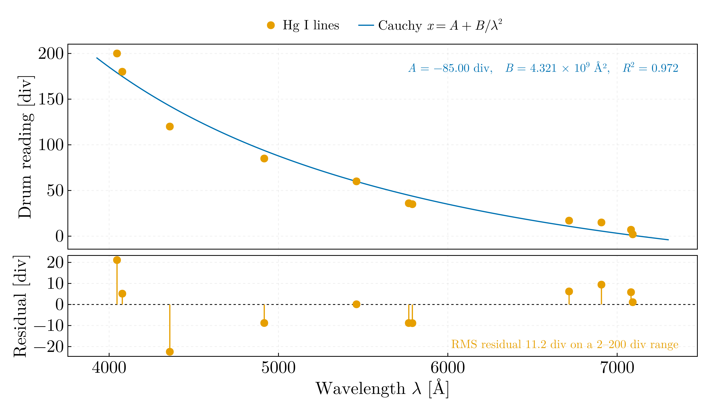

# Experimental methods in physics — MSc year 1 (2021–2022)

## `hg_spectroscope_calibration.jl`

Prism spectroscope calibrated against eleven Hg I lines under the Cauchy
relation `x = A + B/λ²`, `x` the drum reading, on the working assumption that
the drum is linear in the refractive index, which holds near minimum
deviation. The drum reading is regressed on the wavelength, the reference
quantity, in one least-squares step:

| | |
|---|---|
| A | −85.0 ± 9.5 div |
| B | (4.32 ± 0.25) × 10⁹ div Ų |
| R² | 0.972 |
| Residual rms | 11.2 div on a 2–200 div range, largest 22 div at 4358 Å |

The fit is mediocre, and the readings say why. The fitted dispersion gives
the drum spacing two lines should have, 2BΔλ/λ³, and the recorded spacings
depart from it in both directions: the far-red pair 7091.99 and 7081.88 Å
reads 5 divisions apart where the fit gives 0.25, the pair 4358.35 and
4077.81 Å reads 60 where the fit gives 32, and 4077.81 and 4046.56 Å read 20
where the fit gives 4. The script prints the comparison for every adjacent
pair. Those readings are kept as recorded; the script is their only surviving
record. `bsc/06-geometrical-optics/prism_dispersion.jl` fits the same relation
to a directly measured index and finds it adequate to the setting error of
that measurement, so the structure here is in the drum readings, not in the
linearity assumption or the model.

Ported from `Calibrare_Hg.jl` in `Julia-Workflow-FFUB/Single_Files/` on the
`legacy` branch, which lists 5789.66 Å beside 5790.65 Å at divisions 35 and
36. There is no Hg I line at 5789.66 Å: the yellow doublet is 5769.60 and
5790.66 Å (NIST Atomic Spectra Database, doi:10.18434/T4W30F), and with the
drum increasing towards shorter wavelengths division 36 is the 5769.60 Å
member. The value is corrected; it changes R² from 0.97205 to 0.97174, less
than the scatter of the fit. The original solved a model linear in its
coefficients by Levenberg–Marquardt from p₀ = [1, 1], nine orders of
magnitude from B, and then neither printed the coefficients nor displayed its
figure.
