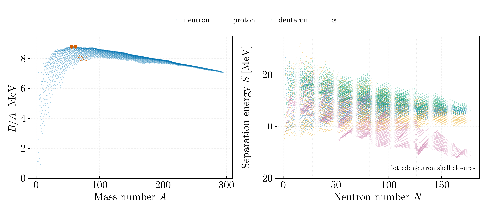
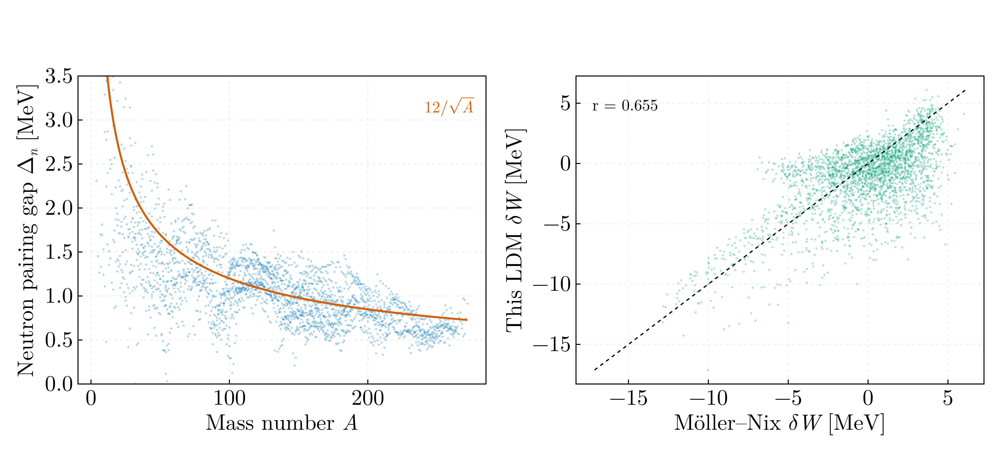
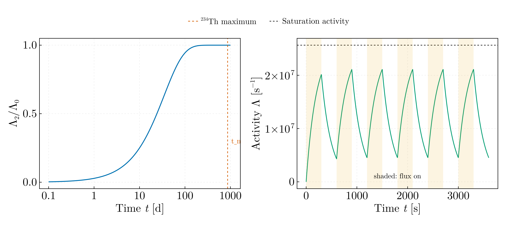

# Radionuclides and nuclear masses — MSc year 1

Seven Octave-era Julia scripts reduced to four, on a shared indexed mass table.

## `mass_tables.jl`

Loads the AME1995 and AME2020/2021 evaluations and the Möller–Nix FRDM
corrections into `Dict`s keyed on (Z, A).

This replaces the access idiom used throughout the originals,

```julia
df.D[(df.A .== A) .& (df.Z .== Z)][1]
```

a full boolean scan of a ~3000-row table allocating two temporaries, executed
several times per nuclide inside a double loop over all nuclides.
`Radionuclizi_3.jl` called a function containing six such scans six times per
(A, Z) pair — of order **2 × 10⁹ element comparisons**, every one of them
type-unstable because the table was a non-`const` global.

It also absorbs the CRLF line endings and trailing spaces of `MOLLER.csv`, the
only file in the archive with them, rather than leaving a latent parser
dependency.

## `binding_and_separation.jl`



| | Value |
|---|---|
| Maximum B/A | **8.7946 MeV at A = 62** |
| ⁶²Ni | 8.7946 MeV |
| ⁵⁶Fe | 8.7904 MeV |

⁶²Ni, not ⁵⁶Fe, is the true maximum — the textbook result, recovered here.
Separation-energy medians: S_n 7.19, S_p 5.82, S_d 12.06, S_α 0.55 MeV, with the
neutron shell closures at N = 28, 50, 82, 126 visible as steps.

Corrections:

- **A broken existence check.** `Radionuclizi_1.jl` tested
  `isassigned(df2.Z[df2.A .== i], j - Z_min + 1)` with `Z_min` taken from the
  *other* library, so it verified only that library 2 had that many isobars at
  mass i — never that the nuclide (i, j) existed — and then indexed it
  unguarded. It survived only because AME95 is a strict subset of AME2021 for
  the call order used. Verified here: **0 of 2931** AME95 nuclides are absent
  from AME2021. Swapping the arguments would have crashed it.
- **Dimensionally inconsistent error propagation.** For ε = 100|D₁−D₂|/D₁ the
  partials are 100·D₂/D₁² and −100/D₁, but the file added a dimensionless 1 to
  quantities carrying keV⁻¹. The result was never plotted — the `yerr` line is
  commented out — so it was dead weight as well as wrong.
- `Grafic_fitare_simplu_neutron(librarie, scalare)` ignored its own argument and
  read the global `audi95` while labelling the plot with `librarie`, so passing
  AME2021 would have produced an AME95 fit labelled AME2021.

## `pairing_and_shell_corrections.jl`



Three-point neutron pairing gap over 2594 nuclides: median **1.015 MeV**, with
an RMS residual of 0.425 MeV against the empirical 12/√A.

Shell correction δW = W_LDM − W_exp from the Pearson liquid drop, on 2847
nuclides shared with Möller–Nix: correlation coefficient **0.655**. The doubly
magic nuclei carry the largest negative corrections, as they must —
²⁰⁸Pb −12.84 MeV, ¹³²Sn −11.55 MeV, ⁷⁸Ni −4.76 MeV.

Besides the hot loop, two defects: `Energie_separare` returned `[true, S]` as a
`Vector{Float64}` or `[false, 0]` as a `Vector{Int64}` — two element types from
one function, then indexed `[1]` as a boolean and `[2]` as an energy; and the
12/√A guide was plotted against a non-monotonic `pairing.A`, so `plot!` joined
consecutive points into a scribble instead of a curve.

## `decay_and_activation.jl`



Two-member Bateman chain ²³⁸U → ²³⁴Th, and ²⁷Al(n,γ)²⁸Al under a pulsed flux.

The daughter activity peaks at **867 days**, and λ₂/λ₁ = 6.8 × 10¹⁰ drives the
secular-equilibrium ratio to 1.000000. Under a 300 s pulsed flux the ²⁸Al
activity settles at 82.4 % of saturation.

**The 2018 Bateman figure was degenerate.** Its time axis came from
`T_scalare = max(T½₁, T½₂)` — the ²³⁸U half-life of 4.468 Gyr — giving a grid
step of 4.5 × 10⁸ yr while the transient peaks at 2.4 yr. The whole interesting
region, the vertical marker and the printed `t_m/T_scalare = 0.0` all collapsed
onto x = 0. A logarithmic time axis shows both scales at once.

Also: ²⁸Al was given a half-life of `2.3*60` s against the evaluated 134.7 s, a
2.4 % error straight into λ; and `savefig` interpolated a `LaTeXString` into the
filename, so the generated name would have contained `$^{238}\textrm{U}$`.

`Radionuclizi_2_2.jl`, an interactive console tool for a single separation
energy, is not ported: it created nine module-level globals from inside a
function — including `A` and `Z`, the most generic names in nuclear physics —
and parsed stdin with `parse` rather than `tryparse`, so any non-numeric
keystroke destroyed the session that its sixty lines of validation existed to
protect. `separation_energy` in `mass_tables.jl` covers the same ground.
