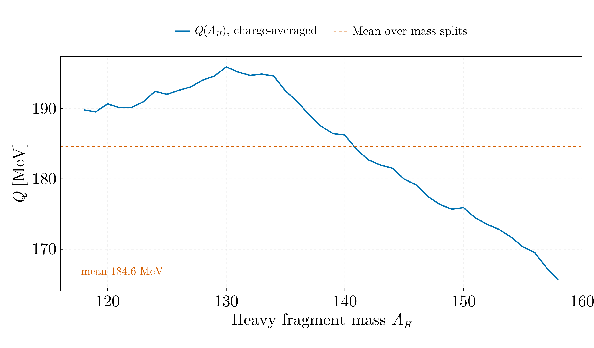
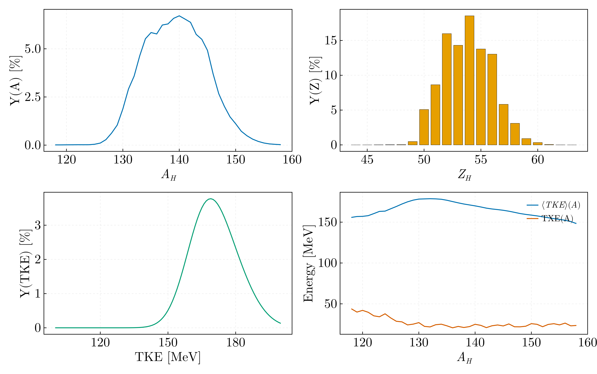
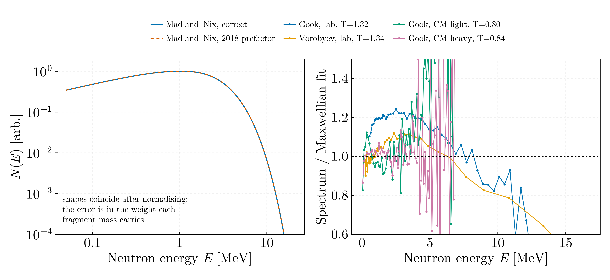
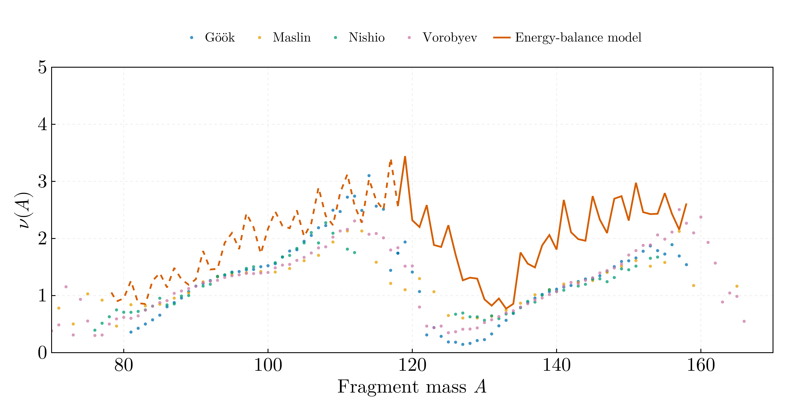

# Fission observables — MSc year 2

Neutron-induced fission of ²³⁵U at thermal energy, from the Straede
Y(A_H, Z_H, TKE) matrix, the AME mass evaluation, Möller–Nix deformations,
Gilbert–Cameron level densities, and four measured ν(A) and neutron-spectrum
datasets.

## `fission_data.jl`

Loaders and indices for all of the above. The originals accessed these tables by
boolean masking inside nested loops; `Fisiune_2.jl:TKE_A` alone made roughly
8000 full passes over the 20 705-row yield matrix.

## `fission_q_value.jl`



Q(A_H) averaged over the isobaric charge distribution. Mean **184.6 MeV**, range
165.6–196.0, peaking at **A_H = 130** — at the ¹³²Sn shell closure, where it
must.

## `fragment_yields.jl`



| Quantity | Value |
|---|---|
| Y(A) peak | A_H = **140**, 6.71 % |
| Y(Z) peak | Z_H = **54** (Xe) |
| Even–odd staggering δ | 0.121 |
| ⟨TKE⟩ | **170.55 MeV** |
| S_n(²³⁶U) | **6.546 MeV** |
| TXE(A) | 20.7–44.0 MeV |

⟨TKE⟩ and S_n both reproduce the evaluated values to three digits.

**Y(N) was over-counted.** The original summed over all rows with a given
N = A_H − Z_H *inside* the double loop over (A_H, Z_H), so the sum was re-added
once per (A, Z) pair mapping to that N — and with five charge splits per mass,
several do. The measured effect: total yield **805.4 %** instead of 100.2 %, an
eightfold inflation, with the peak displaced from N = 87 to N = 86. The
normalisation applied afterwards hid the absolute error but not the distortion.

Also corrected: uncertainties added linearly in three places while the comments
stated quadrature; and `Sortare_distributie` assumed its abscissa contained
every integer between its extremes with no gaps or duplicates — the author hit
this, and five commented-out `deleteat!` lines in `Fisiune_3.jl` document it.

## `neutron_spectrum.jl`



Madland–Nix spectrum and Maxwellian fits to four measured spectra.

| Dataset | T_M [MeV] | χ²/ν |
|---|---|---|
| Göök, lab | 1.3222 | 54.9 |
| Vorobyev, lab | 1.3362 | 3.35 |
| Göök, CM light | 0.7964 | 4.98 |
| Göök, CM heavy | 0.8388 | 1.83 |

The laboratory temperatures land on the evaluated ~1.32 MeV for ²³⁵U(n_th,f),
and the centre-of-mass values sit well below them, as removing the fragment
motion requires.

**The Madland–Nix prefactor was wrong.** The original wrote

```julia
return (1/3*sqrt(E_F*T_MAX)) * ( ... )
```

which parses as `(1/3)·√(E_f·T_m)`, since `/` and `*` share precedence and
associate left to right. The prefactor is **1/(3√(E_f T_m))** — it multiplied
where it had to divide. Because E_f and T_m both vary with fragment mass, the
error does not cancel under the Maxwellian renormalisation applied afterwards;
it reweights the mass average.

E₁(z) and γ(3/2,x) were also re-integrated with `quadgk` at every evaluation,
some 34 000 adaptive quadratures per run, where `SpecialFunctions` has both in
closed form. And `Fisiune_5.jl` divided χ² by N while labelling it χ², and
bounded its optimiser at T_M = 0 where T_M^{-3/2} is infinite.

## `neutron_multiplicity.jl`



ν(A) from an energy balance, against Göök, Maslin, Nishio and Vorobyev.

The model gives ⟨ν_pair⟩ = **3.99** against the evaluated **2.42** — 65 % high.
That is the model and not a coding error: dividing the whole excitation energy
by the neutron cost ignores the competition with prompt γ emission, which
carries off 6–7 MeV per fission, and ⟨ε⟩ = 4T/3 understates the mean emitted
neutron energy. The measured sets average 1.16–1.32 neutrons per fragment,
consistent with 2.42 for the pair.

The defect fixed from `Fisiune_3.jl`:

```julia
for Z_H in minimum(dGC.n):maximum(dGC.n)
```

bounded the loop over *fragment proton number* by the index column of the
Gilbert–Cameron table, so Z_H ran 11 to 150. Unphysical pairs such as
(A_H = 130, Z_H = 100) survived the guards and polluted the level-density
distribution and everything averaged over it. The charge range now comes from
the yield matrix, which spans Z_H = 44–63.

The scission-point deformation model of `Fisiune_3.jl` is **not** reproduced. It
hardcodes six undocumented parametrisation constants — `a = 0.58/13`,
`b = -28*a`, `-0.58/6`, `0.6/15`, `-50*a` — with no source given, and those are
the most model-dependent numbers in the archive.

`Dump.jl` is deleted: it referenced `distributie_bidym`, `Y`, `y_A`, `DataFrame`
and `CSV`, none of which it defined or imported, so it could not run and was
never included by anything. Its one useful routine, the (A,Z)-resolved
⟨TKE⟩(A,Z), is subsumed by the marginalisation in `fragment_yields.jl`.
