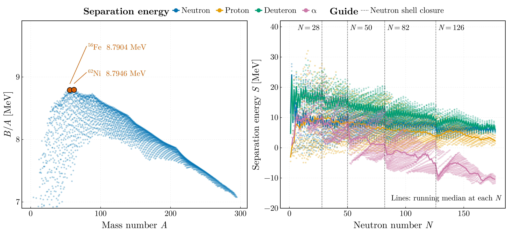
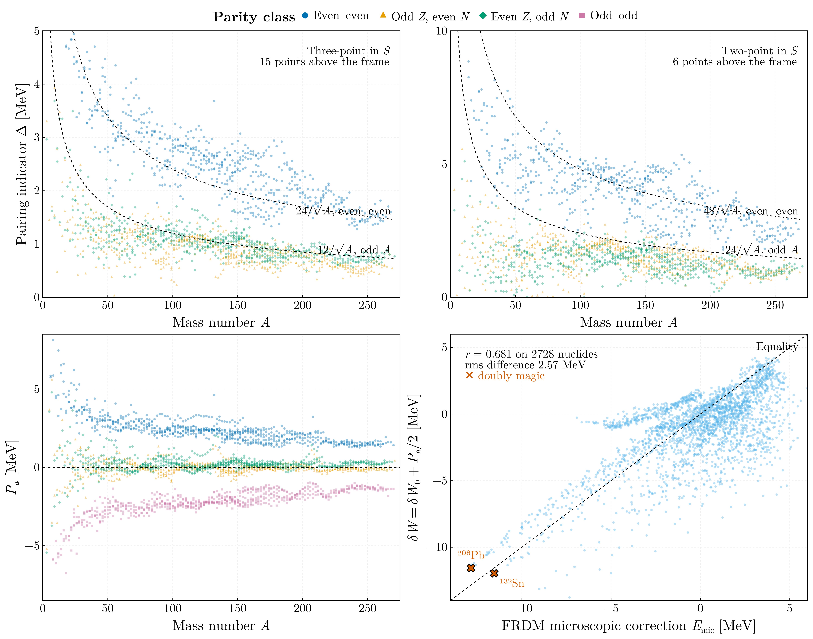
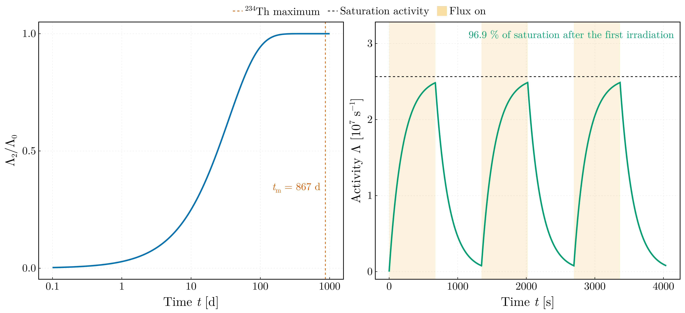

# Radionuclides and nuclear masses — MSc year 1 (2021–2022)

Seven scripts of the course, ported from `Julia-Workflow-FFUB/Radionuclizi_M_1/`
on the `legacy` branch and reduced to four on a shared indexed mass table.
Every script asserts something: a subset relation between the two mass
evaluations, an algebraic identity between two pairing indicators, and the
closed forms of the activity problems.

## `mass_tables.jl`

Loads the AME1995 and AME2020 evaluations and the FRDM microscopic corrections
into `Dict`s keyed on (Z, A), and provides the binding and separation energies
built on them. The originals accessed the tables with expressions of the form
`df.D[(df.A .== A) .& (df.Z .== Z)][1]`, a full boolean scan of a 3000-row
table executed several times per nuclide inside a double loop over all
nuclides; `Radionuclizi_3.jl` made of order 2 × 10⁹ such comparisons through a
non-`const` global.

## `binding_and_separation.jl`

Mean binding energy per nucleon over the 3558 nuclides of AME2020, and the
neutron, proton, deuteron and α separation energies against N. The maximum is
8.7946 MeV at ⁶²Ni; ⁵⁶Fe has 8.7904 MeV. Median separation energies 7.19,
5.82, 12.06 and 0.55 MeV, with the neutron shell closures at N = 28, 50, 82 and
126 as steps in the running medians. The script asserts that every one of the
2931 AME1995 nuclides is present in AME2020, the relation on which the
original's existence check silently rested.

## `pairing_and_shell_corrections.jl`

**Pairing.** Two indicators from the separation energies of neighbouring
nuclides, both offered by `Radionuclizi_3.jl`: the three-point form in S,
¼|S(A+1) − 2S(A) + S(A−1)|, and the two-point form |S(A) − S(A−1)|. With
S(A) = B(A) − B(A−1) the two-point form is the second difference of the binding
energy, |B(A) − 2B(A−1) + B(A−2)| = 2Δ⁽³⁾, which the script asserts to 10⁻¹⁰;
the three-point form is the third difference over four, Δ⁽⁴⁾. For a pure
odd–even staggering B = B̄ ± Δ/2 the first returns Δ and the second 2Δ, so the
two are read against 12/√A and 24/√A respectively. Nuclides are classed as in
the original: odd Z with even N carry Δₙ, even Z with odd N carry Δₚ, and
even–even nuclides carry Δₙ + Δₚ, whose guide is twice the odd-A one.

| Class | Nuclides | Three-point, median Δ√A [MeV] | Two-point, median Δ′√A [MeV] |
|---|---|---|---|
| Even–even, Δₙ + Δₚ | 597 | 27.0 (guide 24) | 43.6 (guide 48) |
| Odd Z, even N, Δₙ | 647 | 9.7 (guide 12) | 16.6 (guide 24) |
| Even Z, odd N, Δₚ | 611 | 11.0 (guide 12) | 15.0 (guide 24) |

The ratio of the two-point to the three-point medians is 1.4–1.7 rather than
2: the smooth A-dependence of S and of the gap itself enters a second and a
third difference differently. The original drew the 12/√A and 24/√A guides
against an unsorted A, as a scribble.

**Shell correction.** δW₀ = W_LDM − W_exp with the liquid-drop binding energy
`W_LDM = a_v A − a_s A^{2/3} − a_c Z² A^{−1/3} − A (a_sym − a_ss A^{−1/3}) I²`,
and δW = δW₀ + ½P_a with `P_a = ½[Δ(Z+1, A+2) − 2Δ(Z, A) + Δ(Z−1, A−2)]` on the
mass excesses, for every AME1995 nuclide whose two P_a neighbours exist, 2796
of them — the analysis of `Radionuclizi_5.jl` as written. P_a is a pairing
quantity: its median is +2.30 MeV for even–even nuclei, −2.17 MeV for odd–odd
and within 0.2 MeV of zero for odd A, so ½P_a removes the pairing part of
W_exp before the comparison with a formula that carries none. Against the FRDM
microscopic correction on the 2728 nuclides in common, δW₀ correlates at
r = 0.659 with an rms difference of 2.70 MeV and δW at r = 0.681 with
2.57 MeV. The doubly magic nuclei carry the largest negative corrections:
²⁰⁸Pb −11.56 MeV against −12.84 in the FRDM, ¹³²Sn −11.96 against −11.55.

**Open question.** The coefficients a_v = 15.65, a_s = 17.63, a_sym = 27.72,
a_ss = 25.60 MeV and r₀ = 1.233 fm are those of `Radionuclizi_5.jl`, which
names them Pearson's parametrisation of the liquid drop without a reference. I
have not been able to check them against a published fit; the value of r₀ and
the volume–surface symmetry form are consistent with Pearson's liquid-drop
fits to the 1995 masses, but the set is quoted here as the file set it.

## `decay_and_activation.jl`

Two-member Bateman chain ²³⁸U → ²³⁴Th and ²⁷Al(n,γ)²⁸Al under a pulsed flux,
with the half-lives of NUBASE2020 (Kondev et al., Chin. Phys. C **45**, 030001
(2021), doi:10.1088/1674-1137/abddae). The daughter activity peaks at
t_m = ln(λ₂/λ₁)/(λ₂ − λ₁) = 867 d, asserted to be the maximum, and λ₂/λ₁ =
6.8 × 10¹⁰ drives the activity ratio to its secular-equilibrium value
λ₂/(λ₂ − λ₁) = 1.000000, asserted twenty daughter half-lives in. Under the
schedule of the original, τ = 5 T½ = 674 s of irradiation alternating with an
equal pause, the ²⁸Al activity ends the first irradiation at exactly 1 − 2⁻⁵ =
96.9 % of saturation, asserted, and settles at 97.0 %.

`Radionuclizi_4_1.jl` built its time axis from `max(T½₁, T½₂)`, the ²³⁸U
half-life of 4.468 Gyr, giving a step of 4.5 × 10⁸ yr for a transient that
peaks at 2.4 yr: the whole interesting region, the vertical marker and the
printed `t_m/T_scalare = 0.0` collapsed onto x = 0. A logarithmic time axis
shows both scales. `Radionuclizi_4_2.jl` gave ²⁸Al a half-life of `2.3*60` s
against the evaluated 134.7 s, 2.4 % straight into λ, and interpolated a
`LaTeXString` into a filename.

`Radionuclizi_2_2.jl`, an interactive console tool for a single separation
energy, is not ported; `separation_energy` in `mass_tables.jl` covers it.

## Data

| File | Content | Source |
|---|---|---|
| `AUDI95.csv` | Z, A, symbol, mass excess and uncertainty [keV], 2931 nuclides | AME1995, Audi and Wapstra, Nucl. Phys. A **595**, 409 (1995), doi:10.1016/0375-9474(95)00445-9; the extraction is not recorded |
| `AUDI2021.csv` | the same layout, 3558 nuclides | AME2020, Wang et al., Chin. Phys. C **45**, 030003 (2021), doi:10.1088/1674-1137/abddaf; the mass excesses carry single-precision rounding (8071.31787 for the neutron's 8071.31806 keV), so the file passed through a `Float32` at extraction, which is not recorded |
| `MOLLER.csv` | Z, A, microscopic correction [MeV], 8983 nuclides | E_mic of the FRDM, Möller, Nix, Myers and Swiatecki, At. Data Nucl. Data Tables **59**, 185 (1995), doi:10.1006/adnd.1995.1002; the same 8983-nuclide set as the RIPL-1 extract `msc/04-fission-observables/data/Parametrizari_auxiliare/B2MOLLER.ANA`, whose header names `moller.dat` of RIPL-1 as its origin. The file is the only one in the archive with CRLF line endings |

The two AME files are byte-identical copies of those in
`msc/04-fission-observables/data/Defecte_masa/`; each module reads its own so
that it runs on its own.
