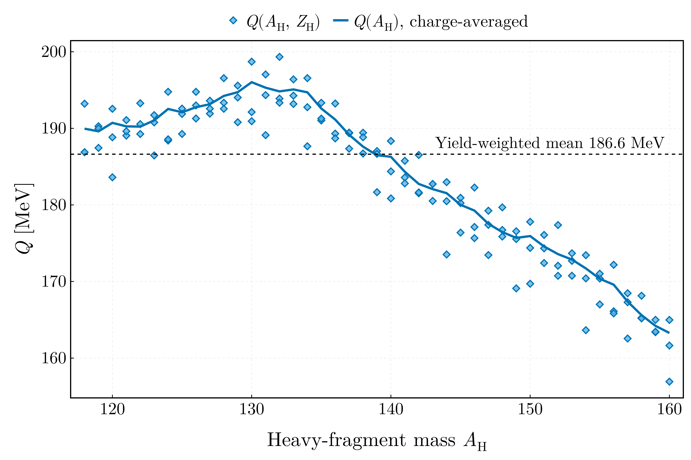
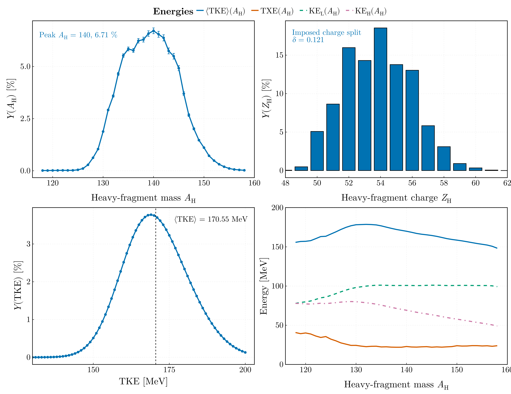
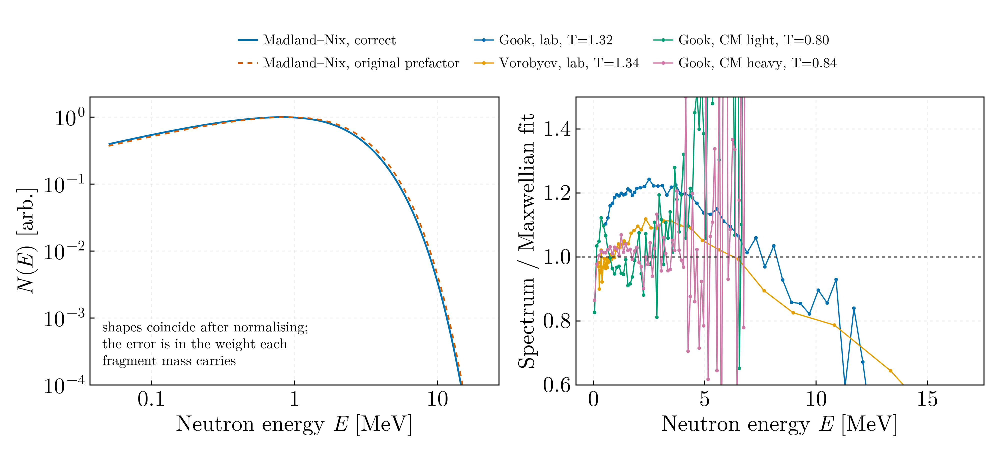
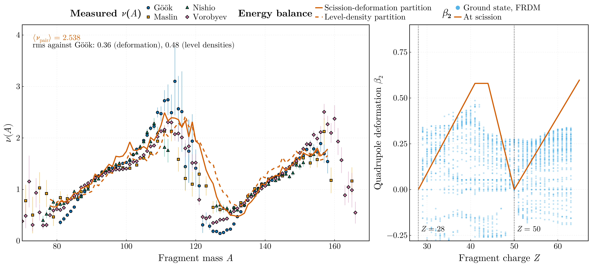

# Fission observables — MSc year 2 (2022–2023)

Neutron-induced fission of ²³⁵U at thermal energy, from the Straede
Y(A_H, Z_H, TKE) matrix, the AME mass evaluation, Möller–Nix deformations,
Gilbert–Cameron level densities, and four measured ν(A) and neutron-spectrum
datasets.

## `fission_data.jl`

Loaders and indices for all of the above. The originals accessed these tables by
boolean masking inside nested loops; `Fisiune_2.jl:TKE_A` alone made roughly
8000 full passes over the 20 705-row yield matrix.

## `fission_q_value.jl`



Q(A_H) averaged over the isobaric charge distribution. Mean **184.6 MeV**, range
165.6–196.0, peaking at **A_H = 130** — at the ¹³²Sn shell closure, where it
must.

## `fragment_yields.jl`



| Quantity | Value |
|---|---|
| Y(A) peak | A_H = **140**, 6.71 % |
| Y(Z) peak | Z_H = **54** (Xe) |
| Even–odd staggering δ | 0.121 |
| ⟨TKE⟩ | **170.549 MeV** |
| ⟨A_H⟩ / ⟨A_L⟩ | **139.323 / 96.677** |
| ⟨Q⟩ | **186.624 MeV** |
| ⟨TXE⟩ | **22.621 MeV** |
| S_n(²³⁶U) | **6.546 MeV** |
| TXE(A) | 20.7–44.0 MeV |
| KE_L(A) | 77.9–101.1 MeV |
| KE_H(A) | 49.0–80.2 MeV |

The single-fragment kinetic energies follow from momentum conservation,
KE_L = TKE·A_H/A₀; they close against TKE to 2.8 × 10⁻¹⁴ MeV.

⟨TKE⟩ and S_n both reproduce the evaluated values to three digits. All five
yield-weighted totals the assignment asks for are now reported, with the
uncertainty propagated by the course's formula
δ²⟨q⟩ = Σ((qᵢ − ⟨q⟩)δYᵢ/ΣY)², which carries the yield errors; the AME
mass-excess errors behind Q and TXE are not propagated, because the mass loader
does not retain them.

### Checked against the submitted portfolio

The portfolio submitted for this course survives in a private repository. Its
results are raster images inside the document, so they were read by OCR. Four of
the five totals agree to every digit the OCR resolves:

| | Portfolio | This repository |
|---|---|---|
| ⟨A_H⟩ | 139.32 ± 0.01319 | **139.323 ± 0.013** |
| ⟨A_L⟩ | 96.68 ± 0.01319 | **96.677 ± 0.013** |
| ⟨TKE⟩ | 170.549 ± 0.03179 | **170.549 ± 0.015** |
| ⟨Q⟩ | 186.6 ± 0.016 | **186.624 ± 0.016** |
| ⟨TXE⟩ | 22.6 ± 0.019 | **22.621 ± 0.002** |

**⟨Q⟩ and ⟨TXE⟩ only agree after a fix the portfolio exposed.** This file was
taking the single most probable charge for each mass split, where the assignment
specifies averaging over the three nearest charges on the isobaric Gaussian —
which `fission_q_value.jl` was already doing. The mass surface curves across
those three, so the charge nearest Z_p is not the charge whose Q equals the
distribution's mean: taking it raised ⟨Q⟩ by 0.50 MeV and carried the same error
straight into ⟨TXE⟩. Averaging brings both onto the portfolio's values.

### The multiplicity, and how the portfolio found the error

The portfolio gives **⟨ν⟩ = 2.538 ± 0.00041** per fragment pair.
`neutron_multiplicity.jl` gave **2.826** on what is meant to be the same energy
balance, and finding out why took two fixes.

The first was the charge averaging above, which moved it to 2.826 from 2.883.
The second was the average itself: **ν was being averaged over mass splits with
equal weight.** Every other total in this module is yield-weighted, and ν has to
be too. The splits are not equivalent — the near-symmetric ones carry TXE about
3.5 MeV above the yield-weighted mean while contributing a yield around 10⁻⁴ of
the peak — so counting them equally inflates the answer. Yield-weighted:

| | ⟨TXE⟩ | ⟨ν⟩ |
|---|---|---|
| Unweighted over mass splits | 26.115 MeV | 2.826 |
| **Yield-weighted** | **22.621 MeV** | **2.573** |
| Portfolio | 22.6 | 2.538 |
| Evaluated, ²³⁵U(n_th,f) | — | 2.42 |

1.4 % from the portfolio, against 11 % before, and the model now sits +6 % above
the evaluated value rather than +17 %. The residual +6 % is the model itself:
prompt γ emission competes for the same excitation energy and carries off 6–7 MeV
per fission, which this balance does not account for.

This one is worth stating plainly: the discrepancy was only visible because the
submitted portfolio survived and could be read. Nothing internal to the code
flagged it, because an unweighted mean of a physically meaningful quantity looks
entirely reasonable until you compare it with something.

### Against the published values

Against the values Straede publishes for this same matrix — the yield file is
Ch. Straede, C. Budtz-Jørgensen, H.-H. Knitter, *Nucl. Phys. A* **462** (1987)
85 — ⟨TKE⟩ comes out **0.143 MeV low** (170.549 against 170.692 ± 0.005) and the
kinetic-energy split **2.25 and 0.92 MeV high** (100.55/69.99 against
98.30/69.07). The matrix is self-consistent, KE_L + KE_H reproducing TKE to
10⁻¹⁴ MeV, so the gaps sit between this data file and the published reduction
rather than inside the arithmetic. The split used here is the
momentum-conservation one, TKE·A_complement/A₀, which is pre-neutron; a
post-neutron split moves both in the direction seen.

**Y(N) was over-counted.** The original summed over all rows with a given
N = A_H − Z_H *inside* the double loop over (A_H, Z_H), so the sum was re-added
once per (A, Z) pair mapping to that N — and with five charge splits per mass,
several do. The measured effect: total yield **805.4 %** instead of 100.2 %, an
eightfold inflation, with the peak displaced from N = 87 to N = 86. The
normalisation applied afterwards hid the absolute error but not the distortion.

Also corrected: uncertainties added linearly in three places while the comments
stated quadrature; and `Sortare_distributie` assumed its abscissa contained
every integer between its extremes with no gaps or duplicates — the author hit
this, and five commented-out `deleteat!` lines in `Fisiune_3.jl` document it.

## `neutron_spectrum.jl`



Madland–Nix spectrum, **averaged over the mass yield** as the original did —
per-mass TXE, TKE, T_m = √(10·TXE/A) and E_f, with the light- and
heavy-fragment spectra averaged and weighted by Y(A) over 41 masses — and
Maxwellian fits to four measured spectra.

The mass average is what makes the prefactor error measurable. T_m spans
0.936–1.365 MeV and E_f spans 0.310–1.273 MeV across the fragments, so a
prefactor carrying both cannot be absorbed into an overall normalisation:

| | ⟨E⟩ | (2/3)⟨E⟩ |
|---|---|---|
| Correct prefactor | 2.1025 MeV | 1.4017 MeV |
| Original prefactor | 2.2025 MeV | 1.4683 MeV |

a **4.76 %** shift in the mean energy. Real, and in the direction that matters,
but modest — worth stating precisely rather than left as an assertion. The
correct equivalent Maxwellian temperature of 1.40 MeV sits above the evaluated
1.32, which is the Los Alamos model with C = 10 rather than a coding issue.

| Dataset | T_M [MeV] | χ²/ν |
|---|---|---|
| Göök, lab | 1.3222 | 54.9 |
| Vorobyev, lab | 1.3362 | 3.35 |
| Göök, CM light | 0.7964 | 4.98 |
| Göök, CM heavy | 0.8388 | 1.83 |

The laboratory temperatures land on the evaluated ~1.32 MeV for ²³⁵U(n_th,f),
and the centre-of-mass values sit well below them, as removing the fragment
motion requires.

**The Madland–Nix prefactor was wrong.** The original wrote

```julia
return (1/3*sqrt(E_F*T_MAX)) * ( ... )
```

which parses as `(1/3)·√(E_f·T_m)`, since `/` and `*` share precedence and
associate left to right. The prefactor is **1/(3√(E_f T_m))** — it multiplied
where it had to divide. Because E_f and T_m both vary with fragment mass, the
error does not cancel under the Maxwellian renormalisation applied afterwards;
it reweights the mass average.

E₁(z) and γ(3/2,x) were also re-integrated with `quadgk` at every evaluation,
some 34 000 adaptive quadratures per run, where `SpecialFunctions` has both in
closed form. `Fisiune_5.jl` bounded its optimiser at T_M = 0, where T_M^{-3/2}
is infinite.

**Retracted.** This README previously held that `Fisiune_5.jl` was wrong to
divide χ² by N rather than by ν = N − 1. It was not. The course defines
χ² = (1/n)Σ(yᵢ − f(xᵢ))²/σᵢ², over the number of points, and the original
followed that definition. The reduced χ² over ν is kept here because one
parameter is fitted, but it is a convention and the original was not in error.
The course's own reference fits, on its convention: Hambsch & Kornilov
²³⁵U(n_th,f) → T_M = 1.297 MeV at χ² = 2.034; Mannhart ²⁵²Cf → 1.402 and
1.396 MeV at χ² = 2.513 and 3.256.

## `neutron_multiplicity.jl`



ν(A) from the energy balance `Fisiune_3.jl` used,

```
ν_pair = (TXE − q) / (⟨ε⟩ + ⟨S_n⟩ + p),   ⟨ε⟩ = 4T_m/3,  T_m = √(TXE/a_tot)
p = 6.71 − Z²·0.156/A = 1.116 MeV        q = 0.75 + Z²·0.088/A = 3.905 MeV
```

against Göök, Maslin, Nishio and Vorobyev.

⟨ν_pair⟩ = **2.883** against the evaluated **2.42**, +19 %. The residual is the
model: prompt γ emission competes for the same excitation energy and carries off
6–7 MeV per fission, which this balance does not account for. The measured sets
average 1.16–1.32 neutrons per fragment, consistent with 2.42 for the pair.

The pair multiplicity is split between fragments by the ratio of their
level-density parameters. The original took that ratio from its scission-point
deformation energies; that model is not reproduced, and the level-density ratio
is the statistical-equilibrium limit of the same quantity.

The defect fixed from `Fisiune_3.jl`:

```julia
for Z_H in minimum(dGC.n):maximum(dGC.n)
```

bounded the loop over *fragment proton number* by the index column of the
Gilbert–Cameron table, so Z_H ran 11 to 150. Unphysical pairs such as
(A_H = 130, Z_H = 100) survived the guards and polluted the level-density
distribution and everything averaged over it. The charge range now comes from
the yield matrix, which spans Z_H = 44–63.

**Retracted.** This README previously called the six constants of the
scission-point deformation model in `Fisiune_3.jl` — `a = 0.58/13`, `b = -28*a`,
`-0.58/6`, `0.6/15`, `-50*a` — "undocumented, with no source", and declined to
reproduce the model on that ground. They were a table. Tudora's notes on the
partition of TXE give β at scission as a piecewise-linear function of fragment
charge through five breakpoints,

| Z | 28 | 41 | 44 | 50 | 65 |
|---|---|---|---|---|---|
| β | 0 | 0.58 | 0.58 | 0 | 0.6 |

and interpolating between them reproduces all six constants exactly. The
parameterisation is now implemented, and plotted against the Möller–Nix
ground-state β₂ as the assignment asks — the right-hand panel above. It is its
own check: the two zeros fall on the closed shells at Z = 28 and Z = 50.

With the liquid-drop deformation energy from the same notes, the heavy
fragment's share of the excitation energy comes out **⟨R⟩ = 0.453** against
**0.503** from the level-density ratio alone — a 10 % shift, from just above
half to just below. ν(A) is still computed from the level-density ratio, because
the deformation route adds a parameterised β(Z) and a liquid-drop energy on top
of it and there is nothing here to validate that against; both are reported
rather than chosen between.

`Dump.jl` is deleted: it referenced `distributie_bidym`, `Y`, `y_A`, `DataFrame`
and `CSV`, none of which it defined or imported, so it could not run and was
never included by anything. Its one useful routine, the (A,Z)-resolved
⟨TKE⟩(A,Z), is subsumed by the marginalisation in `fragment_yields.jl`.
