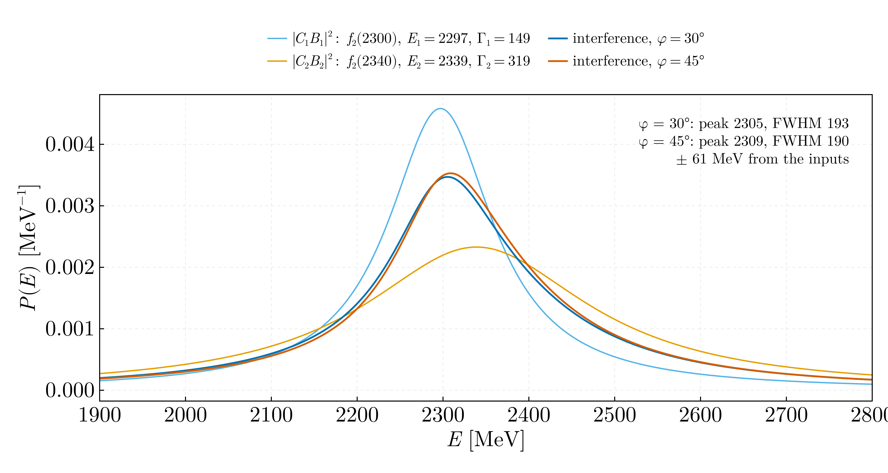
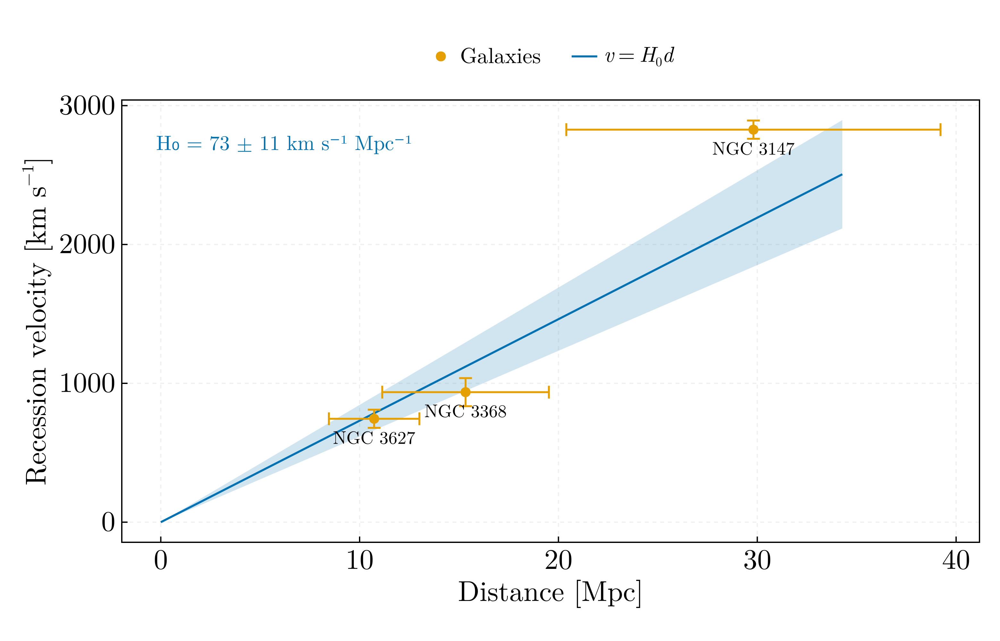

# Nuclear and particle physics — MSc year 2

## `breit_wigner_interference.jl`

Two Breit–Wigner resonances with the same quantum numbers, so their amplitudes
add before squaring.

| | Peak [MeV] | FWHM [MeV] |
|---|---|---|
| f₂(2300) alone | 2297.00 | 149.00 |
| f₂(2340) alone | 2339.00 | 319.00 |
| Interference, φ = 30° | 2305.40 ± 61 | 192.98 ± 50 |
| Interference, φ = 45° | 2308.90 ± 60 | 190.40 ± 47 |

The isolated resonances return their input parameters exactly, which validates
the width measurement. The interference line sits at neither 2297 nor 2339 and
is narrower than the broad resonance — its apparent position and width depend on
the relative phase, which is the point of the exercise.

**The parameters are the assigned ones.** `Breit_Wigner.jl` used 2300/150 and
2340/320 — the resonances' *names*, rounded, with no uncertainties. The
assignment sheet sets them per student, and this student's row gives
f₂(2300) at **2297 ± 60 MeV, Γ = 149 ± 40** and f₂(2340) at **2339 ± 60,
Γ = 319 ± 70**, with phases 30° and 45° and equal generation weights — which is
where C₁ = C₂ comes from, previously assumed without comment.

Carrying those uncertainties changes what the exercise can conclude. The two
phases move the peak by **3.5 MeV**; the quoted resonance parameters allow it to
move by **61 MeV**. The phase dependence is real and it is the point of the
exercise, but with these inputs it is not resolvable — a statement the
calculation could not make while it reported a peak to 0.01 MeV from round
numbers.

The physics in the original was right; the width measurement was not. FWHM was
located by scanning for samples satisfying
`minimum(y)*0.005 >= abs(maximum(y)/2 - i)`, an absolute tolerance keyed to the
array minimum, which finds nothing at all if the sampling straddles the half
maximum and then silently returns whichever near-misses came first and last.
Replaced by linear interpolation between the bracketing samples.

## `hubble_parameter.jl`

H₀ from three galaxies, with redshifts from five reference lines and distances
from apparent size relative to a standard.

**H₀ = 73.1 ± 11.4 km s⁻¹ Mpc⁻¹**, a Hubble time of 13.4 Gyr — consistent with
both Planck (67.4 ± 0.5) and SH0ES (73.0 ± 1.0). The measured recession
velocities are good: 745, 936 and 2827 km s⁻¹ against catalogue values near 727,
897 and 2820.

Two corrections:

- **A one-character typo.** `Suma_σ² =+ σ_z[i]^2` parses as
  `Suma_σ² = +σ_z[i]^2` — an assignment, not `+=`. The running sum of variances
  was overwritten every iteration and kept only the last term, so every averaged
  redshift uncertainty was too small by roughly √n, and the fit weights derived
  from them were wrong.
- **The distance errors were left out of the fit.** They dominate here: σ_d/d
  runs to 30 %. Weighting by velocity errors alone gives H₀ = 89.1 ± 2.0, because
  the distant, poorly-measured galaxy is over-weighted. Using the effective
  variance σ_v² + H₀²σ_d², iterated to convergence, gives 73.1 ± 11.4 — a
  different central value *and* an honest uncertainty.
