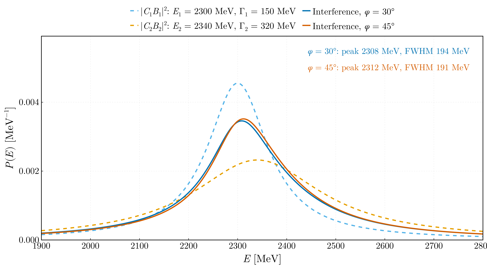
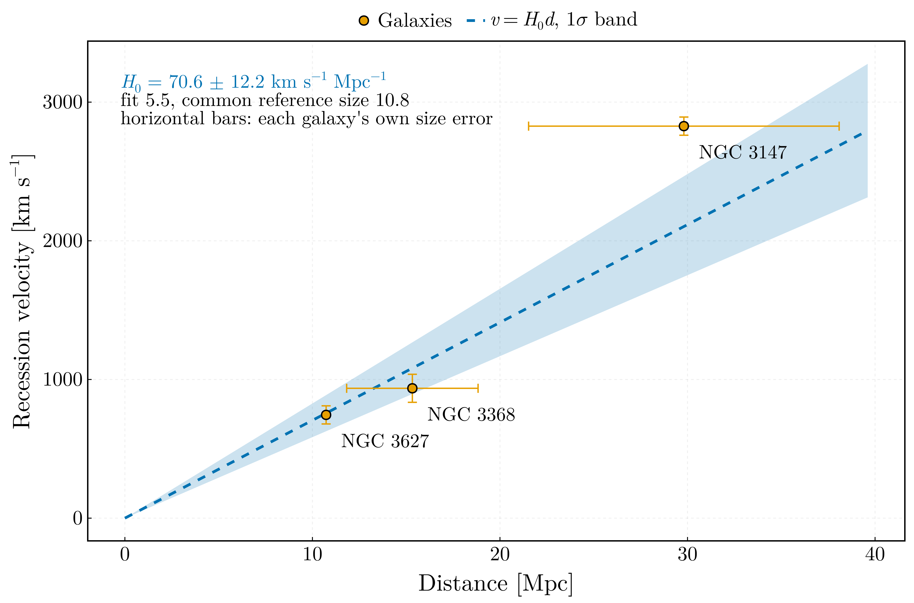

# Nuclear and particle physics — MSc year 2 (2022–2023)

## `breit_wigner_interference.jl`

Two Breit–Wigner resonances with the same quantum numbers, f₂(2300) with
E = 2300, Γ = 150 MeV and f₂(2340) with E = 2340, Γ = 320 MeV, whose
amplitudes add before squaring with a relative phase φ; each amplitude is
normalised to unit integral over 1600–3000 MeV so that the two enter with
equal weight.

| | Peak [MeV] | FWHM [MeV] |
|---|---|---|
| f₂(2300) alone | 2300.0 | 150.0 |
| f₂(2340) alone | 2340.0 | 320.0 |
| Interference, φ = 30° | 2308.4 | 193.6 |
| Interference, φ = 45° | 2311.9 | 191.0 |

The script asserts each normalisation against the closed form of ∫|B|² over
the window, (Γ/2)[arctan(2(b − E₀)/Γ) − arctan(2(a − E₀)/Γ)], and the
measured position and width of each isolated resonance against its inputs.
The interference line sits at neither 2300 nor 2340 MeV and is narrower than
the broad resonance; between the two phases its peak moves by 3.5 MeV and its
width by 2.6 MeV. The resonance parameters are those of the original file,
round numbers by the resonances' names; their measured values and
uncertainties are not used here.

Ported from `Breit_Wigner.jl` in `Julia-Workflow-FFUB/FPECA_M_2/` on the
`legacy` branch. The physics there was right; the full width at half maximum
was located by scanning for samples satisfying
`minimum(y)*0.005 >= abs(maximum(y)/2 - i)`, an absolute tolerance keyed to
the minimum of the array, which finds nothing if no sample lands within it
and otherwise returns whichever near-misses came first and last. Linear
interpolation between the bracketing samples replaces it. The struct holding
the distributions had untyped fields, and the annotation coordinates were
hardcoded in data units.

## `hubble_parameter.jl`

H₀ from three galaxies, NGC 3627, NGC 3368 and NGC 3147: redshifts from the
Ca K, Ca H, Hα, Hβ and Hδ lines with a reading uncertainty of 1.65 Å,
combined as an inverse-variance mean, and distances from the apparent size of
each galaxy relative to NGC 3627 at 10.73 Mpc.

**H₀ = 70.6 ± 12.2 km s⁻¹ Mpc⁻¹**, a Hubble time of 13.9 Gyr. Of the
uncertainty, ±5.5 comes from the fit and ±10.8 from the 15 % uncertainty of
the reference galaxy's apparent size, which scales both other distances by the
same factor and is therefore a scale error of H₀ rather than an independent
error of each galaxy; the script propagates it by refitting with the
reference size moved by ±σ and asserts that it equals H₀ σ_s/s to within the
asymmetry of 1/s. The result is consistent with Planck 2018, 67.4 ± 0.5
(doi:10.1051/0004-6361/201833910), and with SH0ES 2022, 73.04 ± 1.04
(doi:10.3847/2041-8213/ac5c5b), and cannot tell them apart. The recession
velocities, 745, 936 and 2827 km s⁻¹, compare with the NED heliocentric
values 727, 897 and 2820 km s⁻¹ (https://ned.ipac.caltech.edu).

Ported from `Hubble.jl` in `Julia-Workflow-FFUB/FPECA_M_2/` on the `legacy`
branch. Two corrections:

- **a one-character typo.** `Suma_σ² =+ σ_z[i]^2` parses as
  `Suma_σ² = +σ_z[i]^2`, an assignment, not `+=`. The running sum of
  variances kept only its last term, so every averaged redshift uncertainty
  was too small by roughly √n, and the fit weights derived from them were
  wrong
- **the distance errors entered the fit as `1/(σ_v σ_d)²`**, a product of two
  variances that is the variance of nothing. Weighting by velocity errors
  alone gives H₀ = 89.1 ± 2.0, because the distant, poorly measured galaxy is
  over-weighted; the effective variance σ_v² + H₀²σ_d², iterated in H₀, gives
  the value above

## Data

The wavelength readings, the apparent sizes in centimetres and the reference
distance are constants in the two scripts, as they were in the original
files; the spectra and images they were read from are not recorded.
