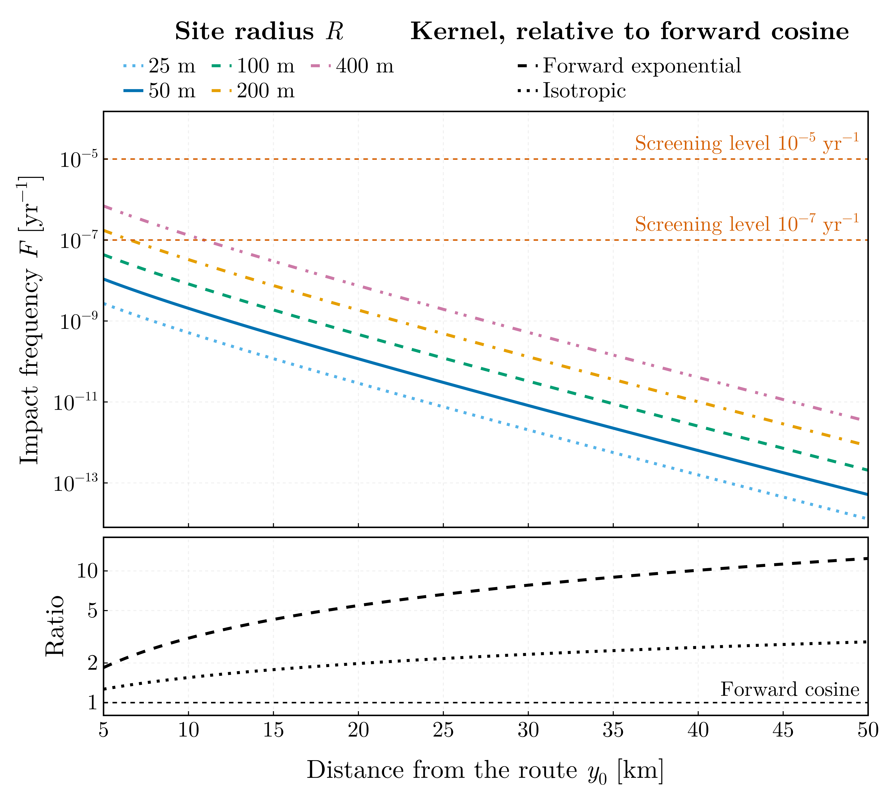

# Aircraft crash hazard screening — late 2023



Annual frequency of an aircraft crash onto an installation of radius R sited a
perpendicular distance y₀ from a straight air route, against the 10⁻⁵ and
10⁻⁷ yr⁻¹ screening levels. Not a course assignment: a Poisson risk exercise
I wrote in late 2023, ported from `Frecventa_accident_aviatic.jl` in
`Julia-Workflow-FFUB/Single_Files/` on the `legacy` branch. The input values
are the original's — P = 10⁻⁹ km⁻¹, N = 7 × 10⁴ yr⁻¹, g = 0.23 km⁻¹, R = 50 m,
y₀ from 5 to 50 km, a route leg x₀ = 200 km — and their sources are not
recorded there, so the absolute frequencies are an exercise, not a screening
result for a site.

## Formulation

The four-factor form of DOE-STD-3014,

```
F = N · P · A · ∫ f(r(x), φ(x)) dx                          [yr⁻¹]

  N   flights per year on the route                          [yr⁻¹]
  P   probability of loss of control per km flown            [km⁻¹]
  A   target area, πR²                                       [km²]
  f   probability per unit area that an aircraft which lost
      control at the point x of the route comes down at the
      site, r = √(x² + y₀²) away and at an angle φ from its
      heading                                                 [km⁻²]
```

with the site small against every length in f. The original's two kernels
both carry the forward factor cos φ = x/r and are set to zero for x ≤ 0: an
aircraft comes down ahead of the point where control was lost, never behind
it. The integration over one side of the route is part of that model and is
kept. What the original got wrong is dimensional. Its integrals,

```julia
integrandRadial          = (x/s) e^{-gs}            # s = √(x² + y₀²)
integrandRadialUnghiular = (x y₀/s²) e^{-gs}        # times g/2
```

are a length and a pure number, so after the common prefactor P·N·πR² neither
was a frequency and the two differed by a length, yet both were drawn on one
axis against thresholds in yr⁻¹. Each is made a density per unit area here,
changing as little as that requires:

- **Forward cosine kernel**, the primary result. The g and the ½ of the
  second kernel are the normalisations of an exponential density g e^{−gr} in r
  and of cos φ/2 over the forward half-plane; the density per unit area with
  those two marginals is f = g e^{−gr} cos φ / (2r). The original has sin φ =
  y₀/r where 1/r belongs, so its value is y₀ times a frequency. Route integral
  (g/2)[E₁(g y₀) − E₁(g s_max)].
- **Forward exponential kernel.** cos φ e^{−gr} normalised over the forward
  half-plane is f = (g²/2) cos φ e^{−gr}; the original's first kernel is 2/g²
  times this. Route integral (g/2)[e^{−g y₀} − e^{−g s_max}], the
  double-exponential airway formula for a long route.
- **Isotropic kernel**, an alternative rather than a correction:
  f = g e^{−gr}/(2πr) integrated over both sides of the route, (g/π) K₀(g y₀).

The script asserts the unit normalisation of each kernel over the plane, every
route integral against its closed form, and the two relations to the
original's estimators, all to 10⁻⁸.

## Results

| y₀ | Forward cosine | Forward exponential | Isotropic |
|---|---|---|---|
| 5 km | 1.09 × 10⁻⁸ yr⁻¹ | 2.00 × 10⁻⁸ | 1.37 × 10⁻⁸ |
| 10 km | 2.06 × 10⁻⁹ | 6.34 × 10⁻⁹ | 3.19 × 10⁻⁹ |
| 25 km | 3.0 × 10⁻¹¹ | 2.0 × 10⁻¹⁰ | 6.6 × 10⁻¹¹ |
| 50 km | 5.2 × 10⁻¹⁴ | 6.4 × 10⁻¹³ | 1.5 × 10⁻¹³ |

At R = 50 m. With the forward cosine kernel at 5 km, R = 200 m gives
1.74 × 10⁻⁷ yr⁻¹; the 10⁻⁷ level is reached at R = 152 m and the 10⁻⁵ level at
1518 m. The target area is the bare geometric disc; DOE-STD-3014 adds skid and
shadow contributions to it, so the footprint used here is a lower bound.
